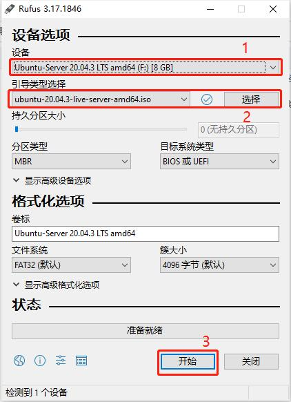

# Rufus制作系统启动盘

## 下载 Rufus

rufus官网下载：[https://rufus.en.softonic.com/download](https://rufus.en.softonic.com/download)

> 注：建议迅雷下载，下载拿到的文件：rufus-3.17.exe

似乎不用安装，直接点击使用即可

## 下载 ubuntu server 20.04 LTS

下载地址：[https://cn.ubuntu.com/download/server/step1](https://cn.ubuntu.com/download/server/step1)

下载保存到电脑上，我保存的位置：

```
D:\ubuntu-20.04.3-live-server-amd64.iso
```

## 插入事先准备好的U盘

> u盘最小4G，否则空间不够写入

> 注意：会清掉u盘里所有数据，所以请先保存u盘的数据到其他地方

## 用rufus将ubuntu系统文件写入u盘

如图：


- 选择u盘
- 选择ubuntu系统文件 `.iso`
- 开始
- 弹出的窗口 ‘检测到ISOHybird镜像’，选 推荐的，然后点 ok 按钮就好了

等待 状态 准备就绪 了 就说明制作成功了，这个过程花的时间还是蛮久的。

