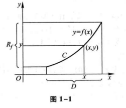
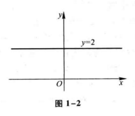
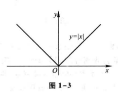
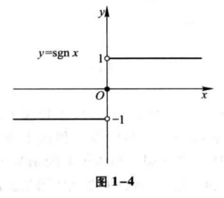
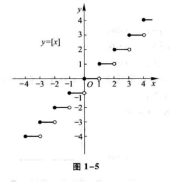
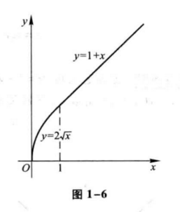

# 第一章 函数与极限

初等数学的研究对象基本上是不变的量，而高等数学的研究对象则是变动 的量.所谓函数关系就是变量之间的依赖关系，极限方法是研究变量的一种基本方法.本章将介绍映射、函数、极限和函数的连续性等基本概念以及它们的一些性质.

## 第一节 映射与函数

映射是现代数学中的一个基本概念，而函数是微积分的研究对象，也是映射的一种.本节主要介绍映射、函数及有关概念，函数的性质与运算等.

### 一、映射

#### 1.映射的概念

定义 设 $X、Y$ 是两个非空集合，如果存在一个法则 $f$ , 使得对 $X$ 中每个元素 $ x $ ，按法则 $ f $ ,在 $Y$ 中有唯一确定的元素 $ y $ 与之对应，那么称 $ f $ 为从 $X$ 到 $Y$ 的映射， 记作

$$
f:X \to Y ,
$$

其中 $y$ 称为元素 $x$ （在映射 $f$ 下）的像，并记作 $ f(x) $ , 即

$$
y = f(x) ,
$$

而元素 $x$ 称为元素 $y$ （在映射 $f$ 下）的一个原像；集合 $X$ 称为映射 $f$ 的定义域，记作 $D_f$，即 $ D_f = X ; X $ 中所有元素的像所组成的集合称为映射 $f$ 的值域，记作 $R_f 或 f(x) $，即

$$
R_f = f(X) = \lbrace f(x) | x \in X \rbrace.
$$

从上述映射的定义中，需要注意的是：

（1）构成一个映射必须具备以下三个要素：集合 $X$ ,即定义域 $D_f = X$ ；集合 $Y$, 即值域的范围： $R_f \subset Y$ ;对应法则 $f$ ，使对每个 $ x \in X $ ,有唯一确定的 $ y = f(x) $ 与之对应.

（2）对每个 $x \in X$ , 元素 $x$ 的像 $y$ 是唯一的；而对每个 $y \in R_f$ , 元素 $y$ 的原像不一定是唯一的；映射 $f$ 的值域 $R_f$ 是 $Y$ 的一个子集，即 $R_f \subset Y$ ,不一定 $R_f = Y$ .

例1 设 $ f:R \rightarrow R $ , 对每个 $ x \in R, f(x) = x^2 . $ 显然， $f$ 是一个映射，$f$ 的定义域 $D_f = R $, 值域 $ R_f = \lbrace y | y \geq 0 \rbrace $ ,它是 $R$ 的一个真子集。 对于 $ R_f $ 中的元素 $y$，除 $y = 0$ 外，它的原像不是唯一的，如 $y=4$ 的原像就有 $ x = 2 $ 和 $x = -2$ 两个.

例2 设 $ X= \lbrace (x,y)|x^2+y^2=1 \rbrace , Y= \lbrace (x,0)| |x| \leq 1 \rbrace, f:X \rightarrow Y $ , 对每个 $(x,y) \in X$ , 有唯一确定的 $(x,0) \in Y$ 与之对应. 显然 $f$ 是一个映射，$f$ 的定义域 $D_f=X$ ，值域 $R_f=Y$ . 在几何上，这个映射表示将平面上一个圆心在原点的单位圆周上的点投影到 $x$ 轴的区间 $[-1,1]$ 上.

例3 设 $ f: \left[ -\frac{π}{2},\frac{π}{2} \right] \to [-1,1] $ , 对每个 $x\in \left[ -\frac{π}{2},\frac{π}{2} \right], f(x)=\sin x. \; f$ 是一个映射，期定义域 $D_f=\left[-\frac{π}{2},\frac{π}{2} \right]$ ，值域 $R_f=[-1,1]$.

设 $f$ 是从集合 $X$ 到集合 $Y$ 的映射，若 $R_f=Y$，即 $Y$ 中任一元素 $y$ 都是 $X$ 中某元素的像，则称 $f$ 为 $X$ 到 $Y$ 上的映射或满射；若对 $X$ 中任意两个不同元素 $x_1 \neq X_2$ ，它们的像 $f(x_1) \neq f(x_2)$，则称 $f$ 为 $X$ 到 $Y$ 的单射；若映射 $f$ 既是单射，又是满射，则称 $f$ 为一一映射（或双射）.

上面例1中的映射，既非单射，又非满射；例2中的映射不是单射，是满射；例3中的映射，既是单射，又是满射，因此是一一映射.

映射又称为算子。根据集合 $X、Y$ 的不同情形，在不同的数学分支中，映射又有不同的惯用名称。例如，从非空集 $X$ 到数集 $Y$ 的映射又称为 $X$ 上的泛函，从非空集 $X$ 到它自身的映射又称为 $X$ 上的变换，从实数集（或其子集）$X$ 到实数集 $Y$ 的映射通常称为定义在 $X$ 上的函数。

#### 2.逆映射和复合映射

设 $f$ 是 $X$ 到 $Y$ 的单射，则由定义，对每个 $y \in R_f$ ，有唯一的 $x\in X$，适合 $f(x) = y$ 。于是，我们可定义一个从 $R_f$ 到 $X$ 的新映射 $g$ ，即

$$
g:R_f \to X ,
$$

对每个 $y \in R_f$ ，规定 $g(y) = x$ ，这满足 $f(x) = y$ 。这个映射 $g$ 称为 $f$ 的逆映射，记作 $f^{-1}$ ，其定义域 $D_{f^{-1}} = R_f$，值域 $R_{f^{-1}} = X$ 。

按上述定义，只有单射才存在逆映射。所以，在例1、例2、例3中，只有例3中的映射 $f$ 才存在逆映射 $f^{-1}$ ，这个 $f^{-1}$ 就是反正弦函数的主值

$$
f^{-1}(x) = \arcsin x, x \in [-1,1],
$$

其定义域 $D_{f^{-1}} = [-1,1]$ ，值域 $R_{f^{-1}} = \left[ -\frac{π}{2}, \frac{π}{2} \right]$.

设有两个映射

$$
g:X \to Y_1, \qquad  f:Y_2 \to Z,
$$

其中 $Y_1 \subset Y_2$ ，则由映射 $g$ 和 $f$ 可以定义出一个从 $X$ 到 $Z$ 的对应法则，它将每个 $x\in X$ 映成 $f[g(x)] \in Z$。显然，这个对应法则确定了一个从 $X$ 到 $Z$ 的映射，这个映射称为映射 $g$ 和 $f$ 构成的复合映射，记作 $f \circ g$ ，即

$$
f \circ g : X \to Z, \; (f \circ g)(x) = f[g(x)],x \in X .
$$

由复合映射的定义可知，映射 $g$ 和 $f$ 构成复合映射的条件是：$g$ 的值域 $R_g$ 必须包含在 $f$ 的定义域内，即 $R_g \subset D_f$ 。否则，不能构成复合映射。由此可以知道，映射  $g$ 和 $f$ 的复合是有顺序的， $f \circ g$ 有意义并不表示 $g \circ f$ 也有意义。即使  $f \circ g$ 和 $g \circ f$ 都有意义，复合映射  $f \circ g$ 和 $g \circ f$ 也未必相同。

例4 设有映射 $g:R \to [-1,1]$ ，对每个 $x \in R, g(x)=\sin x$，映射 $f:[-1,1] \to [0,1]$，对每个 $u \in [-1,1], f(u) = \sqrt[]{1-u^2}$ ，则映射 $g$ 和 $f$ 构成的复合映射 $f \circ g : R \to [0,1]$ ，对每个 $x \in R$ ，有

$$
( f \circ g )(x) = f[g(x)] = f(\sin x) = \sqrt[]{1 - \sin^2 x} = | \cos x | \; .
$$

### 二、函数

#### 1.函数的概念

定义  设数集 $D \subset R$ ，则称映射 $f:D \to R$ 为定义在 $D$ 上的函数，通常简记为

$$
y = f(x), x \in D ,
$$

其中 $x$ 称为自变量， $y$ 称为因变量， $D$ 称为定义域，记作 $D_f$，即 $D_f = D$。

函数的定义中，对每个 $x \in D$ ，按对应法则 $f$ ，总有唯一确定的值 $y$ 与之对应，这个值称为函数 $f$ 在 $x$ 处的函数值，记作 $f(x)$ ，即 $y=f(x)$ 。因变量 $y$ 与自变量 $x$ 之间的这种依赖关系，通常称为函数关系。函数值 $f(x)$ 的全体所构成的集合称为函数 $f$ 的值域，记作 $R_f$ 或 $f(D)$ ，即

$$
R_f = f(D) = \lbrace y | y = f(x), x \in D \rbrace .
$$

需要指出，按照上述定义，记号 $f$ 和 $f(x)$ 的含义是有区别的：前者表示自变量 $x$ 和因变量 $y$ 之间的对应法则，而后者表示与自变量 $x$ 对应的函数值。但为了叙述方便，习惯上常用序号 $"f(x), x \in D"$ 或 $"y=f(x), x \in D"$ 来表示定义在 $D$ 上的函数，这时应理解为由他所确定的函数 $f$。
表示函数的记号是可以任意选取的，长了常用的f外，还可以用其他的英文字母或希腊字母，如 $"g" \; "F" \; "\varphi"$ 等。相应的，函数可记作 $ y = g(x) =, y = F(x), y = \varphi (x) $ 等。有时还直接用因变量的记号来表示函数，即把函数记作 $y=y(x)$ ，但在同一个问题中，讨论到几个不同的函数时，为了表示区别，需用不同的记号来表示它们。
函数是从实数集到实数集的映射，其值域总在 $R$ 内，因此构成函数的要素是：定义域 $D_f$ 及 对应法则 $f$。如果两个函数的定义域相同，对应法则也相同，那么这两个函数就是相同的，否则就是不同的。
函数的定义域通常按照以下两种情形来确定：一种是对有实际背景的函数，根据实际背景中变量的实际意义确定。例如，在自由落体运动中，设物体下落的时间为 $t$，下落的距离为 $s$，开始下落的时刻 $t=0$ ，落地的时间 $t=T$ ，则 $s$ 与 $t$ 之间的函数关系是

$$
s = \frac{1}{2}gt^2, t \in [0,T] .
$$

这个函数的定义域就是区间 $[0,T]$ ；另一种是抽象的用算式表达的函数，通常约定这种函数的定义域是使得算式有意义的一切实数组成的集合，这种定义域称为函数的自然定义域。在这种约定下，一般用的算式表达的函数可用 $"y=f(x)"$ 表达，而不必再标出 $D_f$ 。例如，函数 $y= \sqrt[]{1-x^2}$ 的定义域是闭区间 $[-1,1]$ ，函数 $ y = \frac{1}{ \sqrt[]{1-x^2}}$ 的定义域是开区间 $(-1,1)$。
表示函数的主要方法有三种：表格法、图形法、解析法（公式法）。这在中学里大家已经熟悉。其中，用图形法表示函数是基于函数图形的概念，即坐标平面上的点集

$$
\lbrace P(x,y) | y = f(x), x \in D \rbrace
$$

标为函数 $y=f(x),x \in D$ 的图形（图 1-1）。图中的 $R_f$ 表示函数 $y=f(x)$ 的值域。

下面举几个函数的例子。

例5 函数

$$
y=2
$$

的定义域 $D=(- \infty, +\infty)$ ，值域 $ W = \lbrace 2 \rbrace$，它的图形是一条平行于 $x$ 轴的直线，如 图 1-2 所示。

例6 函数

$$
y=|x| = \begin{cases}
-x, & x < 0 \\ 
x, & x \geq 0 
\end{cases}
$$

的定义域 $D=(- \infty, +\infty)$ ，值域 $R_f = [0, +\infty)$ ，它的图形如图 1-3 所示。这函数称为绝对值函数。

例7 函数

$$
y = sgn \, x = \begin{cases} -1 , x < 0 \\ 0, x = 0 \\ 1, x > 0 \end{cases}
$$

称为符号函数，它的定义域 $D=(- \infty, +\infty)$ ，值域 $ R_f = \lbrace -1, 0, 1 \rbrace $ ，它的图形如图 1-4 所示。对于任何实数 $x$ ，下列关系成立：

$$
x = sgn \, x \cdot |x| .
$$

例8 设 $x$ 为任一实数，不超过 $x$ 的最大整数称为 $x$ 的整数部分，记作 $[x]$ 。例如， $\left[ \frac{5}{7} \right] = 0, [\sqrt[]{2}] = 1, [π] = 3, [-1] = 1, [-3.5] = -4$ 。把 x 看作变量，则函数

$$
y = [x]
$$

的定义域 $D=(-\infty,+\infty)$ ，值域 $R_f = Z$ 。它的图形如图 1-5 所示，这图形称为阶梯曲线。在 $x$ 为整数值处，图形发生跳跃，跃度为1。这函数称为取整函数。

在例6和例7中看到，有时函数要用几个式子表示。这种在自变量的不同变化范围中，对应法则用不同式子来表示的函数，通常称为分段函数。

例9 函数

$$
y=f(x) = \begin{cases}
2 \sqrt[]{x}, & 0 \leq x \leq 1
\\
1+x , & x > 1
\end{cases}
$$

是一个分段函数。它的定义域 $D = [0, +\infty)$ 。当 $x \in [0,1]$ 时，对应的函数值 $f(x) = 2 \sqrt[]{x}$ ；当 $x \in (1, +\infty)$ 时，对应的函数值 $f(x) = 1+x$ 。例如，$\frac{1}{2} \in [0,1]$ ，所以 $ f \left(\frac{1}{2} \right) = 2 \sqrt[]{\frac{1}{2}} = \sqrt[]{2}； 1 \in [0,1]$，所以 $f(1)=2 \sqrt[]{1} = 2; 3 \in (1, +\infty)$ ，所以 $f(3) = 1+3=4$ 。这函数的图形如图 1-6 所示。

用几个式子来表示一个（不是几个！）函数，不仅与函数定义并无矛盾，而且有现实意义。在自然科学和工程技术中，经常会遇到分段函数的情形。例如在等温过程中，气体压强 $p$ 与 体积 $V$ 的函数关系，当 $V$ 不太小时依从玻意耳（Boyle）定律；当 $V$ 相当小时，函数关系就要用范德瓦尔斯（van der Waals）方程来表示，即

$$
p = \begin{cases} \frac{\gamma}{V- \beta} - \frac{a}{V^2} , \beta < V < V_0 , \\ \frac{k}{V}, V \geq V_0, \end{cases}
$$

其中 $k, a, \beta, \gamma $ 都是常量。

#### 2.函数的几种特性

##### （1）函数的有界性

##### （2）函数的单调性

##### （3）函数的奇偶性

##### （4）函数的周期性

TODO ...

### 习题 1-1

## 第二节 数列的极限

### 一、数列极限的定义

### 二、收敛数列的性质

### 习题 1-2

## 第三节 函数的极限

### 一、函数极限的定义

### 二、函数极限的性质

### 习题 1-3

## 第四节 无穷小与无穷大

### 一、无穷小

### 二、无穷大

### 习题 1-4

## 第五节 极限运算法则

### 习题 1-5

## 第六节 极限存在准则 两个重要极限

### 习题 1-6

## 第七节 无穷小的比较

### 习题 1-7

## 第八节 函数的连续性与间断性

### 一、函数的连续性

### 二、函数的间断性

### 习题 1-8

## 第九节 连续函数的运算与初等函数的连续性

### 一、连续函数的和、差、积、商的连续性

### 二、反函数与复合函数的连续性

### 三、初等函数的连续性

### 习题 1-9

## 第十节 闭区间上连续函数的性质

### 一、有界性与最大值最小值定理

### 二、零点定理与介值定理

### 三、一致连续性

### 习题 1-10

## 总习题一

# 第二章 导数与微分

## 第一节 导数概念

### 一、引例

### 二、导数的定义

### 三、导数的几何意义

### 四、函数可导性与连续性的关系

### 习题 2-1

## 第二节 函数的求导法则

### 一、函数的和、差、积、商的求导法则

### 二、反函数的求导法则

### 三、复合函数的求导法则

### 四、基本求导法则与导数公式

### 习题 2-2

## 第三节 高阶导数

### 习题 2-3

## 第四节 隐函数及由参数方程所确定的函数的导数 相关变化率

### 一、隐函数的导数

### 二、由参数方程所确定的函数的导数

### 三、相关变化率

### 习题 2-4

## 第五节 函数的微分

### 一、微分的定义

### 二、微分的几何意义

### 三、基本初等函数的微分公式与微分运算法则

### 四、微分在近似计算中的应用

### 习题 2-5

## 总习题二

# 第三章 微分中值定理与导数的应用

## 第一节 微分中值定理

### 一、罗尔定理

### 二、拉格朗日中值定理

### 三、柯西中值定理

### 习题 3-1

## 第二节 洛必达法则

### 习题 3-2

## 第三节 泰勒公式

### 习题 3-3

## 第四节 函数的单调性与曲线的凹凸性

### 一、函数单调性的判定法

### 二、曲线的凹凸性与拐点

### 习题 3-4

## 第五节 函数的极值与最大值最小值

### 一、函数的极值及其求法

### 二、最大值最小值问题

### 习题 3-5

## 第六节 函数图形的描绘

### 习题 3-6

## 第七节 曲率

### 一、弧微分

### 二、曲率及其计算公式

### 三、曲率圆与曲率半径

### 四、曲率中心的计算公式 渐屈线与渐伸线

### 习题 3-7

## 第八节 方程的近似解

### 一、二分法

### 二、切线法

### 三、割线法

### 习题 3-8

## 总习题三

# 第四章 不定积分

## 第一节 不定积分的概念与性质

### 一、原函数与不定积分的概念

### 二、基本积分表

### 三、不定积分的性质

### 习题 4-1

## 第二节 换元积分法

### 一、第一类换元法

### 二、第二类换元法

### 习题 4-2

## 第三节 分部积分法

### 习题 4-3

## 第四节 有理函数的积分

### 一、有理函数的积分

### 二、可化为有理函数的积分举例

### 习题 4-4

## 第五节 积分表的使用

### 习题 4-5

## 总习题四

# 第五章 定积分

## 第一节 定积分的概念与性质

### 一、定积分问题举例

### 二、定积分的定义

### 三、定积分的近似计算

### 四、定积分的性质

### 习题 5-1

## 第二节 微积分基本公式

### 一、变速直线运动中位置函数与速度函数之间的联系

### 二、积分上限的函数及其导数

### 三、牛顿-莱布尼茨公式

### 习题 5-2

## 第三节 定积分的换元法和分部积分法

### 一、定积分的换元法

### 二、定积分的分部积分法

### 习题 5-3

## 第四节 反常积分

### 一、无穷限的反常积分

### 二、无界函数的反常积分

### 习题 5-4

## 第五节 反常积分的审敛法 $\Gamma$函数

### 一、无穷限反常积分的审敛法

### 二、无界函数的反常积分的审敛法

### 三、$\Gamma$函数

### 习题 5-5

## 总习题五

# 第六章 定积分的应用

## 第一节 定积分的元素法

### 习题 6-1

## 第二节 定积分在几何学上的应用

### 一、平面图形的面积

### 二、体积

### 三、平面曲线的弧长

### 习题 6-2

## 第三节 定积分在物理学上的应用

### 一、变力沿直线所作的功

### 二、水压力

### 三、引力

### 习题 6-3

## 总习题六

# 第七章 微分方程

## 第一节 微分方程的基本概念

### 习题 7-1

## 第二节 可分离变量的微分方程

### 习题 7-2

## 第三节 齐次方程

### 一、齐次方程

### 二、可化为齐次的方程

### 习题 7-3

## 第四节 一阶线性微分方程

### 一、线性方程

### 二、伯努利方程

### 习题 7-4

## 第五节 可降阶的高阶微分方程

### 一、$y^{(n)}=f(x)$型的微分方程

### 二、$y^n=f(x,y^{\prime})$型的微分方程

### 三、$y^n=f(y,y^{\prime})$型的微分方程

### 习题 7-5

## 第六节 高阶线性微分方程

### 一、二阶线性微分方程举例

### 二、线性微分方程的解的结构

### 三、常数变易法

### 习题 7-6

## 第七节 常系数齐次线性微分方程

### 习题 7-7

## 第八节 常系数非齐次线性微分方程

### 一、$f(x)=e^{\lambda x}P_m(x)$型

### 二、$f(x)=e^{\lambda x}[P_l(x) \cos wx + Q_m(x) \sin wx]$型

### 习题 7-8

## 第九节 欧拉方程

### 习题 7-9

## 第十节 常系数线性微分方程组解法举例

### 习题 7-10

## 总习题七

# 附录1 二阶和三阶行列式简介

# 附录2 基本初等函数的图形

# 附录3 几种常用的曲线

# 附录4 积分表

# 习题答案与提示

