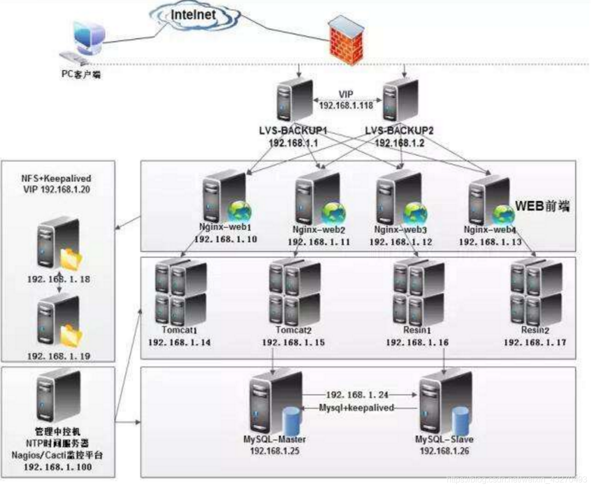

# Nginx--大型网站高并发处理

原文地址：[https://blog.csdn.net/weixin_43270493/article/details/85134759](https://blog.csdn.net/weixin_43270493/article/details/85134759)

## 一、产生背景
### 生活场景
- 大学读书时，每到选修课的时候，学校的选课系统，卡顿，或者直接挂掉
- 淘宝，京东等商场活动，双11，京东618
- 12306网站 购票压力

### 分析原因
- 巨大流量—海量的并发访问
- 单台服务器资源和能力有限

## 二、负载均衡（Load Balance）
### 高并发
见名知意，高（大量的）并发就是可以使用多个线程或者多个进程，同时处理（就是并发）不同的操作。简而言之就是每秒内有多少个请求同时访问。
### 负载均衡
将请求/数据【均匀】分摊到多个操作单元上执行，负载均衡的关键在于【均匀】,也是分布式系统架构设计中必须考虑的因素之一。
### tomcat并发图


由tomcat的并发测试图可以发现，当每秒300个请求同时访问tomcat时，tomcat已经开始承受不住，出现波动。那么大型网站是如何处理高并发的呢？以下是高并发场景下，实现负载均衡的一个分布式架构图。



常见互联网分布式架构，分为客户端层、反向代理nginx层、站点层、服务层、数据层。只需要实现“将请求/数据 均匀分摊到多个操作单元上执行”，就能实现负载均衡。

## 三、Nginx 简介
### 什么是 Nginx?
- Nginx是一款 轻量级 的Web服务器/反向代理服务器及电子邮件（IMAP/POP3）代理服务器。
- 由俄罗斯的程序设计师Igor Sysoev所开发，其特点是占有内存少，并发能力强，nginx的并发能力确实在同类型的网页服务器中表现非常好。
- 2004年10月4日 第一个公开版本0.1.0发布。其将源代码以类BSD许可证的形式发布。
- 官方测试nginx能够支撑5万并发链接，并且CPU、内存等资源消耗却非常低，运行非常稳定。

### 哪些地方使用了Nginx？
- 阿里云
- 阿里巴巴
- 网易
- 蘑菇街
- 土豆
- 爱奇艺
- 新浪网
- 腾讯网
- 京东
- 唯品会
- 优酷
- 乐视网
- 淘宝网
- 360
- 天猫
- ……
## 四、Nginx 对比 Apache
### 优点
- 轻量级，同样起web 服务，比apache 占用更少的内存及资源
- 高并发，nginx 处理请求是异步非阻塞（如前端ajax）的，而 apache 则是阻塞型的，在高并发下nginx能保持低资源低消耗高性能高度模块化的设计，编写模块相对简单
- 还有，它社区活跃，各种高性能模块出品迅速（十几年时间发展）
- Nginx 配置简洁, Apache 复杂
### 不足
- Apache 的 Rewrite重写 ，比nginx 的rewrite 强大模块超多，基本想到的都可以找到。
- Apache 少bug ，nginx 的bug 相对较多。（出身好起步高）
## 五、安装Nginx
### 安装依赖
Nginx依赖 gcc openssl-devel pcre-devel zlib-devel
```
yum -y install gcc openssl-devel pcre-devel zlib-devel
```

### 解压文件
上传压缩包 —>下载连接：[http://nginx.org](http://nginx.org) (我用的是1.8.1)

解压命令：
```
tar -zxvf nginx-1.8.1.tar.gz
```

### configure配置
进入解压后的源码目录，然后执行configure命令进行配置:

命令：
```
./configure
```


### 编译并安装
```
make && make install
```
安装好后，会在/usr/soft下生成nginx目录(这是我编译前指定的)，

这个目录 `/usr/soft/nginx` 就是nginx的软件了。


### 配置Nginx为系统服务，以方便管理
- 1、在/etc/rc.d/init.d/目录中建立文本文件nginx
```
vim /etc/rc.d/init.d/nginx
```
- 2、在文件中粘贴下面的内容：
```
#!/bin/sh
#
# nginx - this script starts and stops the nginx daemon
#
# chkconfig:   - 85 15 
# description:  Nginx is an HTTP(S) server, HTTP(S) reverse \
#               proxy and IMAP/POP3 proxy server
# processname: nginx
# config:      /etc/nginx/nginx.conf
# config:      /etc/sysconfig/nginx
# pidfile:     /var/run/nginx.pid
 
# Source function library.
. /etc/rc.d/init.d/functions
 
# Source networking configuration.
. /etc/sysconfig/network
 
# Check that networking is up.
[ "$NETWORKING" = "no" ] && exit 0
 
nginx="/usr/local/nginx/sbin/nginx"
prog=$(basename $nginx)
 
NGINX_CONF_FILE="/usr/local/nginx/conf/nginx.conf"
 
[ -f /etc/sysconfig/nginx ] && . /etc/sysconfig/nginx
 
lockfile=/var/lock/subsys/nginx
 
make_dirs() {
   # make required directories
   user=`nginx -V 2>&1 | grep "configure arguments:" | sed 's/[^*]*--user=\([^ ]*\).*/\1/g' -`
   options=`$nginx -V 2>&1 | grep 'configure arguments:'`
   for opt in $options; do
       if [ `echo $opt | grep '.*-temp-path'` ]; then
           value=`echo $opt | cut -d "=" -f 2`
           if [ ! -d "$value" ]; then
               # echo "creating" $value
               mkdir -p $value && chown -R $user $value
           fi
       fi
   done
}
 
start() {
    [ -x $nginx ] || exit 5
    [ -f $NGINX_CONF_FILE ] || exit 6
    make_dirs
    echo -n $"Starting $prog: "
    daemon $nginx -c $NGINX_CONF_FILE
    retval=$?
    echo
    [ $retval -eq 0 ] && touch $lockfile
    return $retval
}
 
stop() {
    echo -n $"Stopping $prog: "
    killproc $prog -QUIT
    retval=$?
    echo
    [ $retval -eq 0 ] && rm -f $lockfile
    return $retval
}
 
restart() {
    configtest || return $?
    stop
    sleep 1
    start
}
 
reload() {
    configtest || return $?
    echo -n $"Reloading $prog: "
    killproc $nginx -HUP
    RETVAL=$?
    echo
}
 
force_reload() {
    restart
}
 
configtest() {
  $nginx -t -c $NGINX_CONF_FILE
}
 
rh_status() {
    status $prog
}
 
rh_status_q() {
    rh_status >/dev/null 2>&1
}
 
case "$1" in
    start)
        rh_status_q && exit 0
        $1
        ;;
    stop)
        rh_status_q || exit 0
        $1
        ;;
    restart|configtest)
        $1
        ;;
    reload)
        rh_status_q || exit 7
        $1
        ;;
    force-reload)
        force_reload
        ;;
    status)
        rh_status
        ;;
    condrestart|try-restart)
        rh_status_q || exit 0
            ;;
    *)
        echo $"Usage: $0 {start|stop|status|restart|condrestart|try-restart|reload|force-reload|configtest}"
        exit 2
esac
```
- 3、修改nginx文件的执行权限
```
chmod +x nginx
```
- 4、添加该文件到系统服务中去
```
# 添加命令：
chkconfig  --add  nginx

# 查看是否添加成功:
chkconfig  --list  nginx

# 启动：重启：停止命令:
service nginx  start|restart|stop
```

## 六、Nginx配置
### nginx默认配置详解
```
#进程数，建议设置和CPU个数一样或2倍
worker_processes  2;

#日志级别
error_log  logs/error.log  warning;(默认error级别)

# nginx 启动后的pid 存放位置
#pid        logs/nginx.pid;

events {
	#配置每个进程的连接数，总的连接数= worker_processes * worker_connections
    #默认1024
    worker_connections  10240;
}

http {
    include       mime.types;
    default_type  application/octet-stream;
    sendfile        on;

#连接超时时间，单位秒
keepalive_timeout  65;

    server {
        listen       80;
        server_name  localhost                 
        #默认请求
  		location / {
    				 root  html;   #定义服务器的默认网站根目录位置
   				  index  index.php index.html index.htm;  #定义首页索引文件的名称
        }
	    #定义错误提示页面
        error_page   500 502 503 504  /50x.html;
        location = /50x.html {
            root   html;
        }
}
```
### 负载均衡配置

nginx支持以下负载均衡机制（或方法）：
- 轮询负载均衡 - 对应用程序服务器的请求以循环方式分发，
- 加权负载均衡
- 最少连接数 - 将下一个请求分配给活动连接数最少的服务器
- ip-hash - 哈希函数用于确定下一个请求（基于客户端的IP地址）应该选择哪个服务器。
#### 默认负载平衡配置
使用nginx进行负载平衡的最简单配置如下所示：
```
http { 
    upstream demo{ 
        server node01; //内部服务器
        server node02; 
        server node03; 
    } 

    server { 
        listen 80; 
	    server_name  localhost;
        location / {
            proxy_pass http://demo;
        }
    } 
}
```
在上面的示例中，在srv1-srv3上运行相同应用程序的3个实例。如果没有专门配置负载均衡方法，则默认为循环法。  
所有请求都被 代理到服务器组demo，并且nginx应用HTTP负载平衡来分发请求。  
node01 一次 ， node02 一次， node03 一次 …
#### 加权负载平衡
通过使用服务器权重，还可以进一步影响nginx负载均衡算法，谁的权重越大，分发到的请求就越多。  
```
upstream demo {
    server srv1.example.com weight=3;  
    server srv2.example.com;  //默认是 1  1-10范围
    server srv3.example.com;
}
```
#### 最少连接负载平衡
在连接负载最少的情况下，nginx会尽量避免将过多的请求分发给繁忙的应用程序服务器，而是将新请求分发给不太繁忙的服务器，避免服务器过载。  
相对来说这种方式有点鸡肋…
```
upstream demo {
    least_conn;
    server srv1.example.com;
    server srv2.example.com;
    server srv3.example.com;
}
```
#### 会话持久性
上述的循环或最少连接数的负载平衡方法，每个后续客户端的请求都可能被分发到不同的服务器。不能保证相同的客户端总是定向到相同的服务器。

如果需要将客户端绑定到特定的应用程序服务器 - 换句话说，就是始终选择相同的服务器而言，就要使客户端的会话“粘滞”或“持久” 。

ip-hash负载平衡机制就是有这种特性。使用ip-hash，客户端的IP地址将用作散列键，以确定应该为客户端的请求选择服务器组中的哪台服务器。

此方法可确保来自同一客户端的请求将始终定向到同一台服务器，除非此服务器不可用。
```
upstream demo{
    ip_hash;
    server srv1.example.com;
    server srv2.example.com;
    server srv3.example.com;
}
```
### Nginx的访问控制
Nginx还可以对IP的访问进行控制，allow代表允许，deny代表禁止.
```
location / {
    deny 192.168.2.180;
    allow 192.168.78.0/24;
    allow 10.1.1.0/16;
    allow 192.168.1.0/32;
    deny all;
    proxy_pass http://shsxt;
}
```
从上到下的顺序，匹配到了便跳出。如上的例子先禁止了1个，接下来允许了3个网段，其中包含了一个ipv6，最后未匹配的IP全部禁止访问.
## 七、虚拟主机
### 什么是虚拟主机？
虚拟主机是指在网络服务器上分出一定的磁盘空间，用户可以租用此部分空间，供用户放置站点及应用组件，提供必要的数据存放和传输功能。

说白了虚拟主机就是把一台物理服务器划分成多个“虚拟”的服务器，各个服务器之间完全独立，在外界看来，每一台虚拟主机和一台单独的主机的表现完全相同。

所以这种被虚拟化的逻辑主机被形象的成为 “虚拟主机”.

**优点**  
由于多台虚拟主机共享一台真实主机的资源，每个虚拟主机用户承受的硬件费用、网络维护费用、通信线路的费用均大幅度降低。许多企业建立网站都采用这种方法，这样不仅大大节省了购买机器和租用专线的费用，网站服务器管理简单，诸如软件配置、防病毒、防攻击等安全措施都由专业服务商提供，大大简化了服务器管理的复杂性；同时也不必为使用和维护服务器的技术问题担心，更不必聘用专门的管理人员。

**类别：**
- 基于域名的虚拟主机，通过域名来区分虚拟主机
- 基于端口的虚拟主机，通过端口来区分虚拟主机
- 基于ip 的虚拟主机，很少用。


### 基于域名的虚拟主机
```
http { 
    upstream demo{ 
        server node01; 
	} 
    upstream test{ 
        server node03; 
    } 
 	server { 
        listen 80; 
        //访问demo.com的时候，会把请求导到demo的服务器组里
		server_name  demo.com;
        location / {
            proxy_pass http://demo;
        }
	} 
    server { 
        listen 80; 
	    //访问test.com的时候，会把请求导到test的服务器组里
	    server_name  test.com; 
        location / {
            proxy_pass http://test;
        }
	} 
}
```
node01, node03 是在虚拟机中配置的ip别名

可在 /etc/hosts中配置
```
127.0.0.1   localhost localhost.localdomain localhost4 localhost4.localdomain4
::1         localhost localhost.localdomain localhost6 localhost6.localdomain6
192.168.150.101  node01
192.168.150.102  node02
192.168.150.103  node03
```
> 注意：基于域名的虚拟机主机 在模拟应用场景时，需要在windows系统的hosts文件里配置域名映射。（C:\Windows\System32\drivers\etc\hosts）

```
192.168.150.101  test.com
192.168.150.103  demo.com
```

### 基于端口的虚拟主机
```
upstream demo{
    server node03;
}

upstream test{
    server node01;
}

server {
    //当访问nginx的 81端口时，将请求分发到 test组
    listen 81;
    server_name  localhost;
    location / {
        proxy_pass http://test;
    }
}

server {
    //当访问nginx的 80端口时，将请求分发到  demo组
    listen       80;
    server_name  localhost;
    location / {
        proxy_pass http://demo;
    }
}
```
## 八、正向代理和反向代理
### 正向代理
举个栗子：我是一个用户，我访问不了某网站，但是我能访问一个代理服务器，这个代理服务器呢,他能访问那个我不能访问的网站，于是我先连上代理服务器,告诉他我需要那个无法访问网站的内容，代理服务器去取回来,然后返回给我。像我们经常通过vpn访问国外的网站，此时就是正向代理。

**客户端必须设置正向代理服务器，当然前提是要知道正向代理服务器的IP地址，还有代理程序的端口。**

### 反向代理
反向代理方式是指以代理服务器来接收internet上的连接请求，然后将请求转发给内部网络上的服务器，并将从服务器上得到的结果返回给Internet上请求连接的客户端，此时代理服务器对外就表现为一个反向代理服务器。

反向代理隐藏了真实的服务端，当我们请求 www.baidu.com 的时候，就像拨打 10086 一样，背后可能有成千上万台服务器为我们服务，但具体是哪一台，你不知道，也不需要知道，你只需要知道反向代理服务器是谁就好了，www.baidu.com 就是我们的反向代理服务器，反向代理服务器会帮我们把请求转发到真实的服务器那里去。Nginx 就是性能非常好的反向代理服务器，用来做负载均衡。

## 九、Nginx session一致性问题

**http协议是无状态的，即你连续访问某个网页100次和访问1次对服务器来说是没有区别对待的，因为它记不住你。**

那么，在一些场合，确实需要服务器记住当前用户怎么办？

比如用户登录邮箱后，接下来要收邮件、写邮件，总不能每次操作都让用户输入用户名和密码吧，为了解决这个问题，session的方案就被提了出来，事实上它并不是什么新技术，而且也不能脱离http协议以及任何现有的web技术.

session的常见实现形式是会话cookie（session cookie），即未设置过期时间的cookie，这个cookie的默认生命周期为浏览器会话期间，只要关闭浏览器窗口，cookie就消失了。

### Session共享
首先我们应该明白，为什么要实现共享，如果你的网站是存放在一个机器上，那么是不存在这个问题的，因为会话数据就在这台机器，但是如果你使用了负载均衡把请求分发到不同的机器呢？这个时候会话id在客户端是没有问题的，但是如果用户的两次请求到了两台不同的机器，而它的session数据可能存在其中一台机器，这个时候就会出现取不到session数据的情况，于是session的共享就成了一个问题。

### Session一致性解决方案
- 1、session 复制：tomcat 本身带有复制session的功能(这里不做介绍)。
- 2、共享 session：需要专门管理session的软件，memcached 缓存服务，可以和tomcat整合，帮助tomcat共享管理session。
### 安装 memcached
#### 安装memcached内存数据库
```
yum -y install memcached
```
启动的命令:
```
memcached -d -m 128m -p 11211 -l 你安装memcached的ip -u 用户名 -P 密码/没有为空 /tmp/
# tmp 是存放路径
# -p  端口号
# -d  以daemon方式运行 --守护线程(后台运行)
# -m  允许最大内存用量，单位是M （默认是64M）
```
停止命令：
```
[root@node03 lib]# ps -ef|grep memcached
root       1536      1  0 02:34 ?        00:00:00 memcached -d -m 128m -p 11211 -l 192.168.150.103 -u root -P /tmp/
root       1684   1168  0 03:08 pts/0    00:00:00 grep memcached
[root@node03 lib]# kill -9 1536
```
#### web服务器连接memcached的jar包拷贝到tomcat的lib
我这里用的tomcat 只要把相关jar传到tomcat的 lib目录下即可 如图：


#### 配置tomcat的conf目录下的context.xml
注意：每个被nginx代理的tomcat都需要配置
```
<Manager className="de.javakaffee.web.msm.MemcachedBackupSessionManager"
    memcachedNodes="n1:   ====##你配置memcached的虚拟机ip##===   :11211"
    sticky="true"
    lockingMode="auto"
    sessionBackupAsync="false"
   requestUriIgnorePattern=".*\.(ico|png|gif|jpg|css|js)$"
sessionBackupTimeout="1000" transcoderFactoryClass="de.javakaffee.web.msm.serializer.kryo.KryoTranscoderFactory" />
```
配置memcachedNodes属性，配置memcached数据库的ip和端口，默认11211，多个的话用逗号隔开.

目的是为了让tomcat服务器从memcached缓存里面拿session或者是放session.

#### 修改tomcat中的index.jsp，取sessionid看一看
```
<%@ page language="java" contentType="text/html; charset=UTF-8"  pageEncoding="UTF-8"%>
<html lang="en">
SessionID:<%=session.getId()%>
</br>
SessionIP:<%=request.getServerName()%>
</br>
<h1>tomcat1</h1>
</html>
```
可以看到虽然每次请求 nginx 分发到的服务器不是一个，但是sessionID始终唯一，证明session共享成功实现.