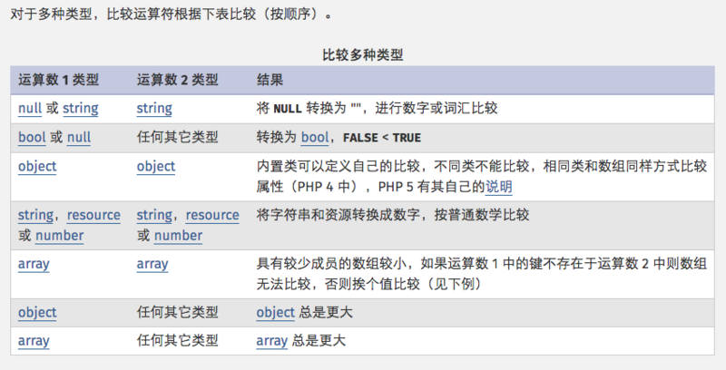
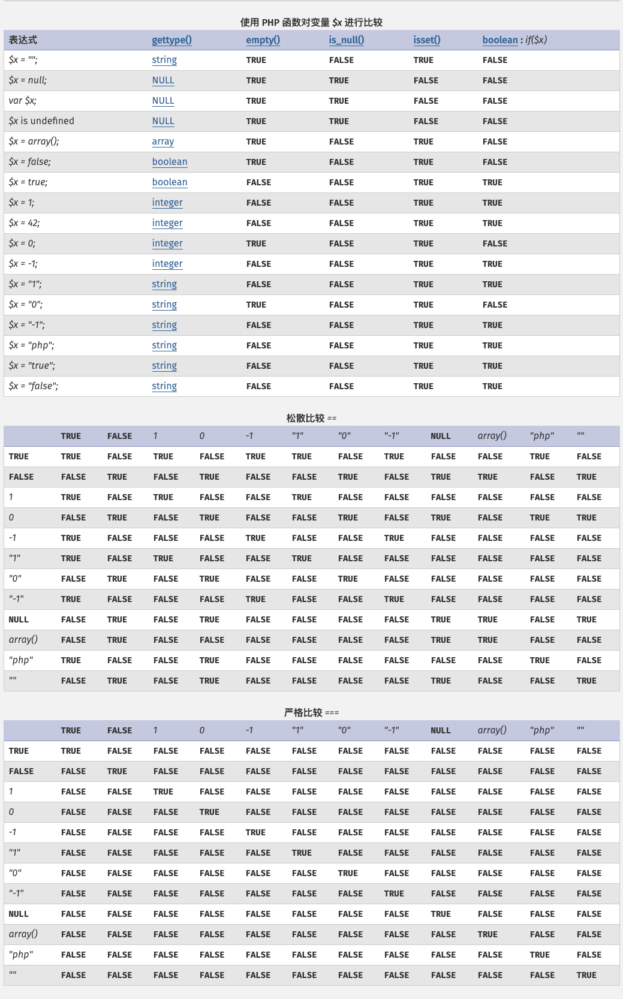

# PHP类型比较
###### 返回 [PHP基础知识](../PHP基础知识.md)
***


虽然 PHP 是弱类型语言，但也需要明白变量类型及它们的意义，因为我们经常需要对 PHP 变量进行比较，包含松散和严格比较。
- 松散比较：使用两个等号 `==` 比较，只比较值，不比较类型。
- 严格比较：用三个等号 `===` 比较，除了比较值，也比较类型。

例如，"42" 是一个字符串而 42 是一个整数。FALSE 是一个布尔值而 "FALSE" 是一个字符串。
```
<?php
if(42 == "42") {
    echo '1、值相等';
}
 
echo PHP_EOL; // 换行符
 
if(42 === "42") {
    echo '2、类型相等';
} else {
    echo '3、类型不相等';
}
?>
```
以上实例输出结果为：
```
1、值相等
3、类型不相等
```


## PHP中 比较 0、false、null
测试代码:
```
<?php
echo '0 == false: ';
var_dump(0 == false);
echo '0 === false: ';
var_dump(0 === false);
echo PHP_EOL;
echo '0 == null: ';
var_dump(0 == null);
echo '0 === null: ';
var_dump(0 === null);
echo PHP_EOL;
echo 'false == null: ';
var_dump(false == null);
echo 'false === null: ';
var_dump(false === null);
echo PHP_EOL;
echo '"0" == false: ';
var_dump("0" == false);
echo '"0" === false: ';
var_dump("0" === false);
echo PHP_EOL;
echo '"0" == null: ';
var_dump("0" == null);
echo '"0" === null: ';
var_dump("0" === null);
echo PHP_EOL;
echo '"" == false: ';
var_dump("" == false);
echo '"" === false: ';
var_dump("" === false);
echo PHP_EOL;
echo '"" == null: ';
var_dump("" == null);
echo '"" === null: ';
var_dump("" === null);
```
以上实例输出结果为：
```
0 == false: bool(true)
0 === false: bool(false)

0 == null: bool(true)
0 === null: bool(false)

false == null: bool(true)
false === null: bool(false)

"0" == false: bool(true)
"0" === false: bool(false)

"0" == null: bool(false)
"0" === null: bool(false)

"" == false: bool(true)
"" === false: bool(false)

"" == null: bool(true)
"" === null: bool(false)
```

对于多种类型，比较运算符根据下标比较（按顺序）：

| 运算数1类型 | 运算数2类型 | 结果 |
| --- | --- | :--- |
| null或string | string | 将 NULL 转化为 ""，进行数字或词汇比较 |
| bool 或 null | 任何其他类型 | 转换为 bool，false < true |
| object | object | 内置类可以定义自己的比较，不同类不能比较，相同类和数组同样方式比较属性（PHP4中），PHP5有其自己的说明 |
| string，resource或number | string，resource或number | 将字符串和资源转换成数字，按普通数字比较 |
| array | array | 具有较少成员的数组较小，如果运算数1中的键不存在于运算数2中则数组无法比较，否则挨个值比较（见下例） |
| object | 任何其他类型 | object总是更大 |
| array | 任何其他类型 | array总是更大 |

  



# 读者笔记
***


***
#
###### 返回 [PHP基础知识](../PHP基础知识.md)