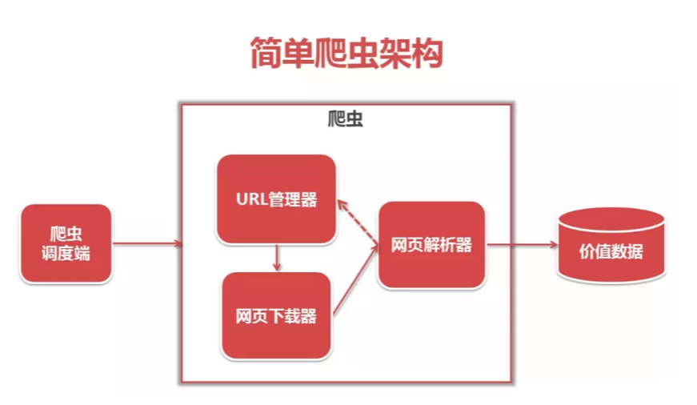
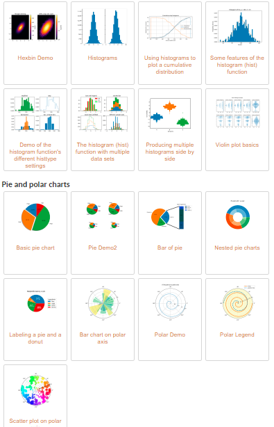
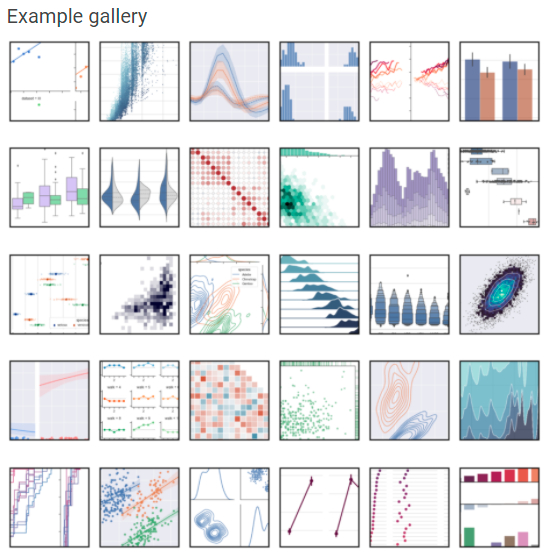

###### 爬虫
- 爬虫：是一段自动抓取互联网信息的程序；抓取互联网相关数据为自己所用
- 基本架构：爬虫调度器 -> URL管理器 -> 网页下载器() -> 网页解析器() -> 价值数据
  

###### 模块名：requests - 从服务器获取数据
###### 模块名：BeautifulSoup - 解析和提取网页中的数据
- 【解析数据】把从服务器获取到的数据，“翻译”成程序能读懂代码，通过程序提取到想要的数据
- 【提取数据】是指把我们需要的数据从源数据中有针对性地挑选出来
###### 模块名：Pandas - 数据分析最常用的一个包
- Pandas提供了大量能使我们快速便捷地处理数据的函数和方法，使表格化数据的工作快速、简单、有表现力。所以利用Pandas进行数据操作、预处理、清洗是Python数据分析中的重要技能
###### 模块名：matplotlib - Python可视化程序库的泰斗
- Matplotlib和Seaborn是最为常用的数据可视化的工具包，解决如何通过数据来绘制图表，来更好的展示数据
- 经过十几年它仍然是Python使用者最常用的画图库，他的官方gallery就有26个大类527个样式，无论是数量还是质量都能碾压市面上大部分同功能软件
- 
###### 模块名：Seaborn - 用简洁的代码来制作好看的图表
- Seaborn跟matplotlib最大的区别就是它的默认绘图风格和色彩搭配都具有现代美感
- 
###### 模块名：NumPy- 运行速度非常快的数学库，主要用于数组计算
- NumPy是一个用于数值运算的Python库，专门对数值运算进行优化，最大的优势是快
- NumPy 通常与 SciPy和 Matplotlib一起使用， 这种组合广泛用于替代 MatLab，是一个强大的科学计算环境，有助于我们通过 Python 学习数据科学或者机器学习
