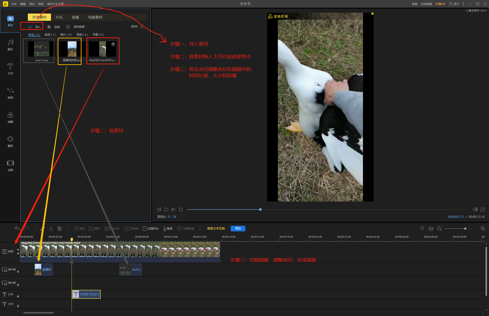

###### [点击下载软件](https://download.apowersoft.cn/down.php?softid=beecut-bd&_bv=6827967920544783972&_cc=8&_ch=aps-bd&_ct=1615474059&_dm=lightmake.cn&_gn=ANGLE%20(Intel(R)%20UHD%20Graphics%20Direct3D11%20vs_5_0%20ps_5_0)&_sh=1440&_sw=2160&_tz=GMT%2B0800&_uc=%E8%9C%9C%E8%9C%82%E5%89%AA%E8%BE%91&_ud=2021-03-11%2022%3A47%3A23&_um=cpc&_us=baidu&_ut=%E6%80%8E%E6%A0%B7%E7%BB%99%E8%A7%86%E9%A2%91%E6%89%93%E9%A9%AC%E8%B5%9B%E5%85%8B&_vi=e7773714903b9a4de83cddaf3b32a903&_bv=6827967920544783972&_cc=8&_ch=aps-bd&_ct=1615474115&_dm=lightmake.cn&_gn=ANGLE%20(Intel(R)%20UHD%20Graphics%20Direct3D11%20vs_5_0%20ps_5_0)&_sh=1440&_sw=2160&_tz=GMT%2B0800&_uc=%E8%9C%9C%E8%9C%82%E5%89%AA%E8%BE%91&_ud=2021-03-11%2022%3A47%3A23&_um=cpc&_us=baidu&_ut=%E6%80%8E%E6%A0%B7%E7%BB%99%E8%A7%86%E9%A2%91%E6%89%93%E9%A9%AC%E8%B5%9B%E5%85%8B&_vi=e7773714903b9a4de83cddaf3b32a903&_bv=6827967920544783972&_cc=8&_ch=aps-bd&_ct=1615475730&_dm=lightmake.cn&_gn=ANGLE%20(Intel(R)%20UHD%20Graphics%20Direct3D11%20vs_5_0%20ps_5_0)&_sh=1440&_sw=2160&_tz=GMT%2B0800&_uc=%E8%9C%9C%E8%9C%82%E5%89%AA%E8%BE%91&_ud=2021-03-11%2022%3A47%3A23&_um=cpc&_us=baidu&_ut=%E6%80%8E%E6%A0%B7%E7%BB%99%E8%A7%86%E9%A2%91%E6%89%93%E9%A9%AC%E8%B5%9B%E5%85%8B&_vi=e7773714903b9a4de83cddaf3b32a903&_bv=6827967920544783972&_cc=8&_ch=aps-bd&_ct=1615475730&_dm=lightmake.cn&_gn=ANGLE%20(Intel(R)%20UHD%20Graphics%20Direct3D11%20vs_5_0%20ps_5_0)&_sh=1440&_sw=2160&_tz=GMT%2B0800&_uc=%E8%9C%9C%E8%9C%82%E5%89%AA%E8%BE%91&_ud=2021-03-11%2022%3A47%3A23&_um=cpc&_us=baidu&_ut=%E6%80%8E%E6%A0%B7%E7%BB%99%E8%A7%86%E9%A2%91%E6%89%93%E9%A9%AC%E8%B5%9B%E5%85%8B&_vi=e7773714903b9a4de83cddaf3b32a903)

###### [点击查看教程](https://beecut.cn/tutorial-video/)


###### 基本步骤：
```
1 导入素材【视频、图片】
2 将素材拖入下方对应的进度条中
3 切割视频、调整水印大小位置、合成并导出视频
```

