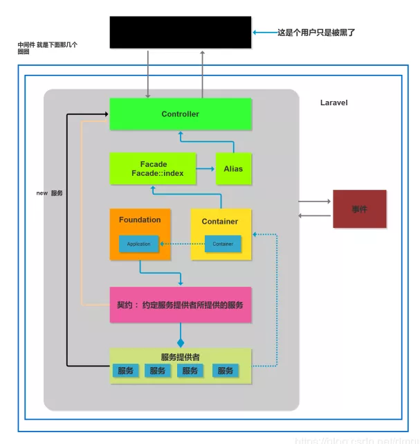

# [怎么理解Laravel的核心架构](https://www.cnblogs.com/heyue0117/p/12345162.html)

## 使用过larave框架的朋友都知道laravel框架里面除了提供一些基本的功能（如控制器、视图、模型）之外，还有中间件、门面、契约等，这些东西是如何在laravel框架运用起来的呢？今天就和大家详聊一下。

首先应该了解laravel框架的架构模式（设计核心，laravel 框架是使用服务组件化的开发模式开发的，laravel框架就是由不同的服务组件构成的）

laravel 里面多个服务提供者构成了laravel组件。分层设计：把相同功能的类库放在同一个文件夹里面。
laravel框架有多个类组成服务，由多个服务组成组件。类 -> 服务 -> 组件
laravel使用组件化的开发模式，多个类 -> 服务 -> 组件，多个类组成服务，多个服务构成组件。
多个组件提供不同的服务，然后多个服务构成我们的项目。
请求生命周期
大概的流程如图：


理论上，生命周期主要有这么些阶段，但其中，开发者大多数只需关注**路由、中间件、控制器、闭包函数、逻辑处理**等几步
当然，每一步的内部，还是会有更多细化的执行流程，在这里，一般不深入研究框架或改造框架，很少会细化研究，但研究底层，依旧是学习的好选择。

**服务**
说的就是提供给你所需要的东西，在laravel里面所提供的服务有 认证服务、数据库服务、缓存服务、队列服务等等。laravel框架所有服务都定义在了**app/config/app.php** 里面

**服务提供者**
可以给你提供一组服务的东西就是服务提供者，laravel里面如上所示其实定义的服务器提供者，比如 **IlluminateAuthAuthServiceProvider::class** ,提供认证服务的服务提供者。 **IlluminateCacheCacheServiceProvider::class** ,提供缓存服务的服务提供者

**好处:** 开发者可以节省下更多的精力去处理项目逻辑，且不同开发个体之间能达到一定默契，最重要的是，项目达到分层解耦，业务逻辑只依赖于服务，并不依赖于服务底层的实现。
解耦之后，我们可以任意升级或自定义服务的底层实现，只要确保底层类实现了该服务

**总结：** 其实服务是一个抽象的概念，服务器提供者是完成这个抽象概念的具体实施者

**服务容器**
把所有的服务放在一个盒子里，存放服务的容器。laravel里面的服务容器位于

```
vendor\laravel\framework\src\Illuminate\Container\Container.php
```

Container.php 就是laravel框架的服务容器。

**契约**
用来规划服务提供者的格式、方法、参数等，给服务提供者规范了一定约束。所以在框架里面所有的契约都是接口，这样才能规范服务提供者。

**门面**
门面再一次展示了Laravel在设计上的优秀，它让Laravel变得更加灵活易扩展，那么它的概念是：
1 为开发者提供服务容器中服务的静态代理
2 它对服务访问方式做了补充，之前使用服务必须获取服务的实例，再调用服务的方法，但使用facade，就可以直接把服务当静态对象来调用了。
3 config/app.php中服务别名alias大多数都使用了facade
4 使用facade是有风险的，并不是用的越多越好，这在手册上有少量的介绍，但具体的，还是需要开发中去发现

**laravel框架总体架构图**



如上图所示：laravel框架是由**多个服务组件**构成的 ->  **服务提供者** （最下面的不同的服务组件）。
Foundation 的 Application 用来创建服务提供者，创建好之后保存在Container 的 Container 的服务容器里面，交由他管理，Application 要继承 Container。
为了约定服务提供者提供的服务，我们定义一个规范，这就是 **契约** 。

对于我们的用户（最上面的用户）想使用laravel框架，必须通过控制器来使用（上面的Controller），使用laravel框架主要是使用laravel里面的服务提供者（上面的 new 服务），这样就是最传统的开发模式，和服务器容器没有直接关系，如果laravel这样设计的话，基本上和其他框架一样，没有任何优势。所以一般不怎么做。

由于有契约，契约是服提供者的接口，所以我们也可以直接使用契约，new 服务旁边的黄色线。使用契约用注入的方式，这样使用的不好之处是如果一个方法里面使用多个契约的话，我们就得注入多个契约，这样代码看起来不优雅。

于是laravel里面就出现了 **门面** ，门面的出现方便我们优雅的调用服务器提供者的类。由于每个服务提供者的类太长了如：


所以又引出了别名，使用别名之后 简化了我们调用的服务提供者的类。

**事件：** laravel里面的模型里面的事件，比如用户对数据库操作时做的一个监听。对整个项目运行进行监听，有监听的动作。类似tp5里面的钩子和行为。
**中间件：** 做用户的请求做一定的过滤。

