#### 使用教程 https://learnku.com/courses/laravel-package/2019/nested-set-nested-set-model-baumbaum/1968

## 个人学习
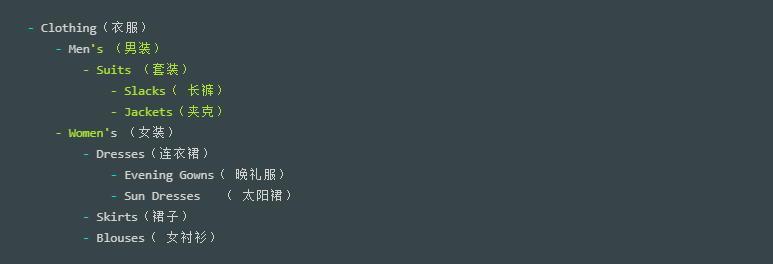

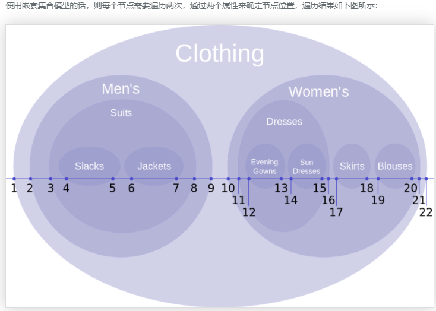
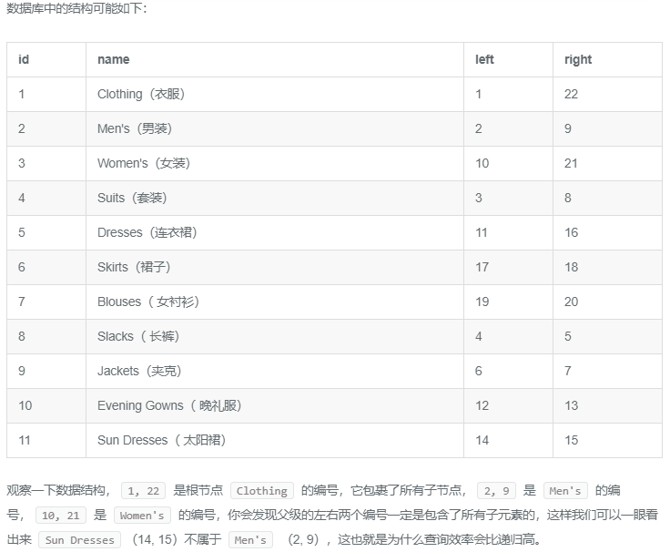

#### 进一步理解

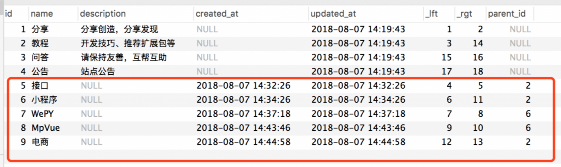
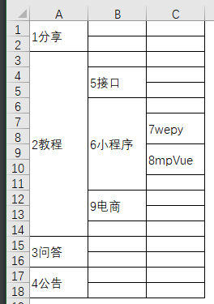

第一层 A，第二层 B，第三层 C 

ID 1 到 9 ，代表数据库中的每一条分类数据，每一个ID占用两个节点，子节点会被嵌套在父节点中；

### 结合上图理解：
###### 下面是每插入一个子类，整棵树的节点变动过程【这里我是用Excel做演示的】：
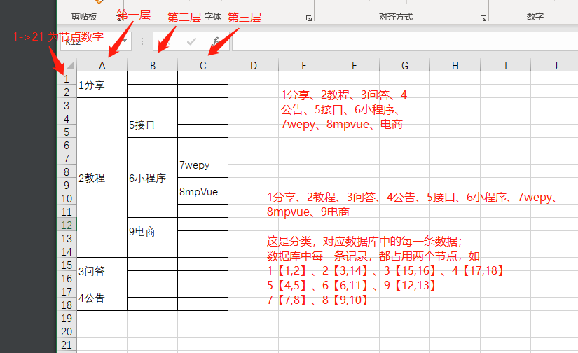

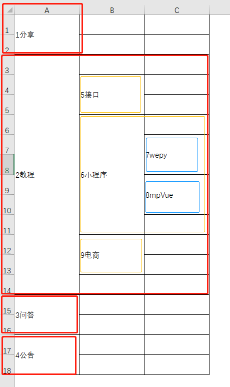
##### 从 id=1 一直添加 到 id=9，每条记录的节点变动如下：
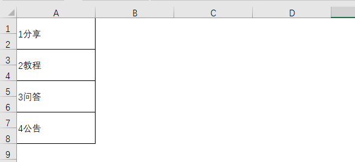
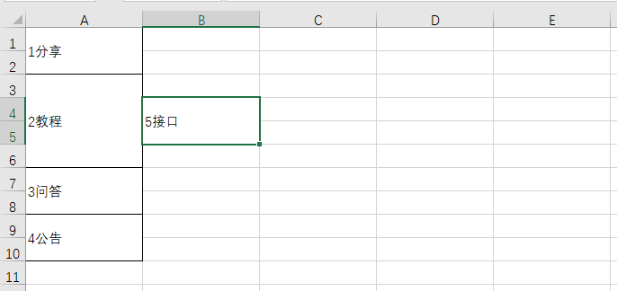
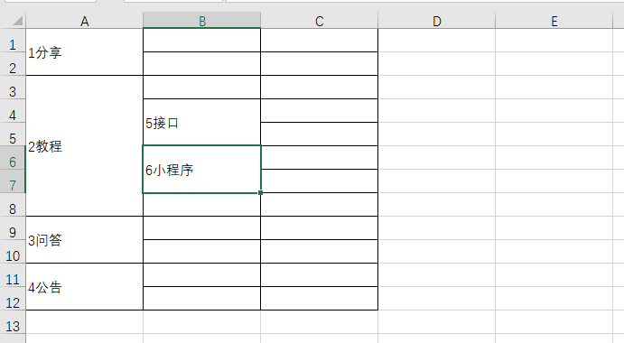
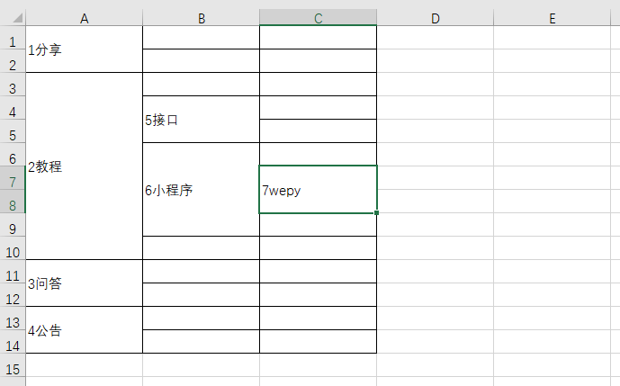
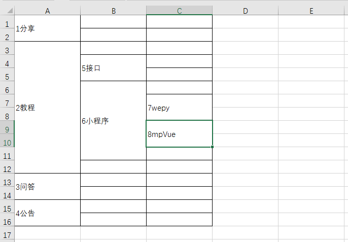
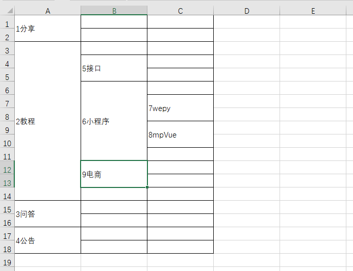

这里有位朋友对此做了些说明：[mysql无限级分类](https://www.cnblogs.com/badboys/p/9945296.html)

先写这么多，以后有了更深入的理解再继续补充，

如果有幸被哪位朋友看到了，欢迎多多指点，在此表示感谢！