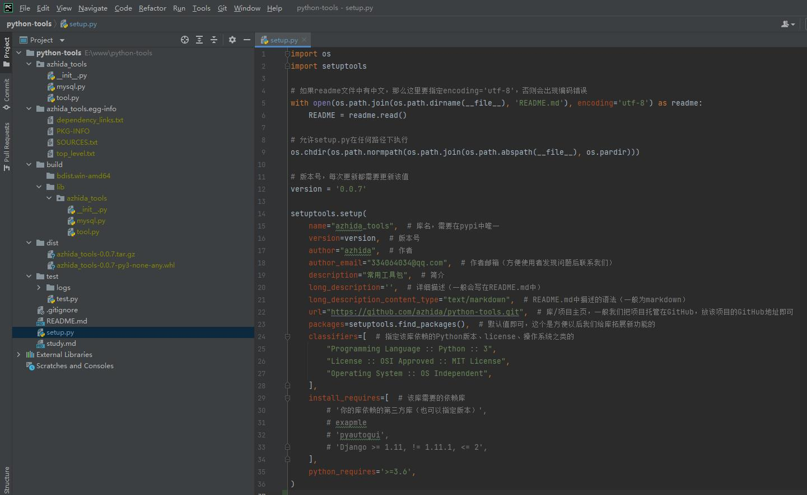

### pypi 官网  注册账号
pypi 官网：https://pypi.org/

#### 附上我的第一个包地址
github：https://github.com/azhida/python-tools  
pypi（pip）：https://pypi.org/project/azhida-tools/

### 安装必要程序
```
python -m pip install setuptools wheel twine
```

### 创建包结构


### 打包
```
python setup.py sdist bdist_wheel
```
### 检查包
```
python -m twine check dist/*
```
### 上传 pypi
```
python -m twine upload dist/*
```
### 下载安装
```
python -m pip install -U azhida-tools
```
### 引入使用包
```
from azhida_tools import mysql
from azhida_tools import tool

tool.test(1)
mysql.test(123)
```
