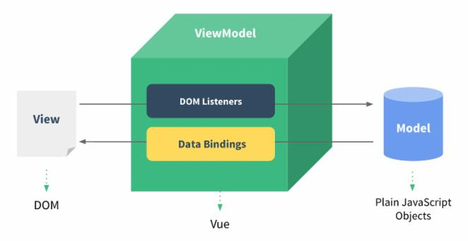

# Vue3 表单

#### 返回 [Vue基础知识](../Vue基础知识.md)

这节我们为大家介绍 Vue 表单上的应用。  
我们可以用 `v-model` 指令在表单 `<input>`、`<textarea>` 及 `<select>` 等元素上创建双向数据绑定。  



v-model 会根据控件类型自动选取正确的方法来更新元素。  
v-model 会忽略所有表单元素的 value、checked、selected 属性的初始值，使用的是 data 选项中声明初始值。  
v-model 在内部为不同的输入元素使用不同的属性并抛出不同的事件：
- text 和 textarea 元素使用 value 属性和 input 事件；
- checkbox 和 radio 使用 checked 属性和 change 事件；
- select 字段将 value 作为属性并将 change 作为事件。

### 输入框  
实例中演示了 input 和 textarea 元素中使用 v-model 实现双向数据绑定：

```
<!DOCTYPE html>
<html>
<head>
<meta charset="utf-8">
<title>Vue 测试实例 - Vue教程</title>
<script src="https://unpkg.com/vue@next"></script>
</head>
<body>
<div id="app">
  <p>input 元素：</p>
  <input v-model="message" placeholder="编辑我……">
  <p>input 表单消息是: {{ message }}</p>
    
  <p>textarea 元素：</p>
  <textarea v-model="message2" placeholder="多行文本输入……"></textarea>
  <p>textarea 表单消息是:</p>
  <p style="white-space: pre">{{ message2 }}</p>
  
</div>

<script>
const app = {
  data() {
    return {
      message: '',
	  message2: 'Vue教程\r\nhttps://www.baidu.com'
    }
  }
}

Vue.createApp(app).mount('#app')
</script>
</body>
</html>
```
在文本区域 textarea 插值是不起作用，需要使用 v-model 来代替：
```
<!-- 错误 -->
<textarea>{{ text }}</textarea>

<!-- 正确 -->
<textarea v-model="text"></textarea>
```

### 复选框

复选框如果是一个为逻辑值，如果是多个则绑定到同一个数组：
> 以下实例中演示了复选框的双向数据绑定：
```
<!DOCTYPE html>
<html>
<head>
<meta charset="utf-8">
<title>Vue 测试实例 - Vue教程</title>
<script src="https://unpkg.com/vue@next"></script>
</head>
<body>
<div id="app">
  <p>单个复选框：</p>
  <input type="checkbox" id="checkbox" v-model="checked">
  <label for="checkbox">{{ checked }}</label>
    
  <p>多个复选框：</p>
  <input type="checkbox" id="runoob" value="Runoob" v-model="checkedNames">
  <label for="runoob">Runoob</label>
  <input type="checkbox" id="google" value="Google" v-model="checkedNames">
  <label for="google">Google</label>
  <input type="checkbox" id="taobao" value="Taobao" v-model="checkedNames">
  <label for="taobao">taobao</label>
  <br>
  <span>选择的值为: {{ checkedNames }}</span>
</div>

<script>
const app = {
  data() {
    return {
      checked : false,
      checkedNames: []
    }
  }
}

Vue.createApp(app).mount('#app')
</script>
</body>
</html>
```

### 单选按钮

```
<!DOCTYPE html>
<html>
<head>
<meta charset="utf-8">
<title>Vue 测试实例 - Vue教程</title>
<script src="https://unpkg.com/vue@next"></script>
</head>
<body>
<div id="app">
  <input type="radio" id="runoob" value="Runoob" v-model="picked">
  <label for="runoob">Runoob</label>
  <br>
  <input type="radio" id="google" value="Google" v-model="picked">
  <label for="google">Google</label>
  <br>
  <span>选中值为: {{ picked }}</span>
</div>

<script>
const app = {
  data() {
    return {
      picked : 'Runoob'
    }
  }
}

Vue.createApp(app).mount('#app')
</script>
</body>
</html>
```

### select 列表

```
<!DOCTYPE html>
<html>
<head>
<meta charset="utf-8">
<title>Vue 测试实例 - Vue教程</title>
<script src="https://unpkg.com/vue@next"></script>
</head>
<body>
<div id="app">
  <select v-model="selected" name="fruit">
    <option value="">选择一个网站</option>
    <option value="www.runoob.com">Runoob</option>
    <option value="www.google.com">Google</option>
  </select>
 
  <div id="output">
      选择的网站是: {{selected}}
  </div>
</div>

<script>
const app = {
  data() {
    return {
      selected: '' 
    }
  }
}

Vue.createApp(app).mount('#app')
</script>
</body>
</html>
```

多选时会绑定到一个数组：
```
<!DOCTYPE html>
<html>
<head>
<meta charset="utf-8">
<title>Vue 测试实例 - Vue教程</title>
<script src="https://unpkg.com/vue@next"></script>
</head>
<body>
<div id="app">
  <select v-model="selected" name="fruit" multiple>
    <option value="www.runoob.com">Runoob</option>
    <option value="www.google.com">Google</option>
    <option value="www.taobao.com">Taobao</option>
  </select>
 
  <div id="output">
      选择的网站是: {{selected}}
  </div>
</div>

<script>
const app = {
  data() {
    return {
      selected: '' 
    }
  }
}

Vue.createApp(app).mount('#app')
</script>
</body>
</html>
```

使用 v-for 循环输出选项：
```
<!DOCTYPE html>
<html>
<head>
<meta charset="utf-8">
<title>Vue 测试实例 - Vue教程</title>
<script src="https://unpkg.com/vue@next"></script>
</head>
<body>
<div id="app" class="demo">
  <select v-model="selected">
    <option v-for="option in options" :value="option.value">
      {{ option.text }}
    </option>
  </select>
  <span>选择的是: {{ selected }}</span>
</div>

<script>
const app = {
  data() {
    return {
      selected: 'www.runoob.com',
      options: [
        { text: 'Runoob', value: 'www.runoob.com' },
        { text: 'Google', value: 'www.google.com' },
        { text: 'Taobao', value: 'www.taobao.com' }
      ]
    }
  }
}

Vue.createApp(app).mount('#app')
</script>
</body>
</html>
```

### 值绑定

对于单选按钮，复选框及选择框的选项，v-model 绑定的值通常是静态字符串 (对于复选框也可以是布尔值)：
```
<!-- 当选中时，`picked` 为字符串 "a" -->
<input type="radio" v-model="picked" value="a" />

<!-- `toggle` 为 true 或 false -->
<input type="checkbox" v-model="toggle" />

<!-- 当选中第一个选项时，`selected` 为字符串 "abc" -->
<select v-model="selected">
  <option value="abc">ABC</option>
</select>
```

但是有时我们可能想把值绑定到当前活动实例的一个动态属性上，这时可以用 v-bind 实现，此外，使用 v-bind 可以将输入值绑定到非字符串。

#### 复选框 (Checkbox)：
```
<input type="checkbox" v-model="toggle" true-value="yes" false-value="no" />
...
// 选中时
vm.toggle === 'yes'
// 取消选中 
vm.toggle === 'no'
```
#### 单选框 (Radio)：
```
<input type="radio" v-model="pick" v-bind:value="a" />
// 当选中时
vm.pick === vm.a
```
#### 选择框选项 (Select)：
```
<select v-model="selected">
  <!-- 内联对象字面量 -->
  <option :value="{ number: 123 }">123</option>
</select>
// 当被选中时
typeof vm.selected // => 'object'
vm.selected.number // => 123
```

## 修饰符
### .lazy
在默认情况下， v-model 在 input 事件中同步输入框的值与数据，但你可以添加一个修饰符 lazy ，从而转变为在 change 事件中同步：
```
<!-- 在 "change" 而不是 "input" 事件中更新 -->
<input v-model.lazy="msg" >
```
### .number
如果想自动将用户的输入值转为 Number 类型（如果原值的转换结果为 NaN 则返回原值），可以添加一个修饰符 number 给 v-model 来处理输入值：
```
<input v-model.number="age" type="number">
```
这通常很有用，因为在 type="number" 时 HTML 中输入的值也总是会返回字符串类型。
### .trim
如果要自动过滤用户输入的首尾空格，可以添加 trim 修饰符到 v-model 上过滤输入：
```
<input v-model.trim="msg">
```


# 读者笔记

---

#### 返回 [Vue基础知识](../Vue基础知识.md)
