# PHP知识结构
原文地址：[https://www.cnblogs.com/iamspecialone/p/11216442.html](https://www.cnblogs.com/iamspecialone/p/11216442.html)

## 一 PHP知识体系框架图

原文地址：[https://blog.csdn.net/yan_fang/article/details/51406803](https://blog.csdn.net/yan_fang/article/details/51406803)

### 1、LAMPer技能树
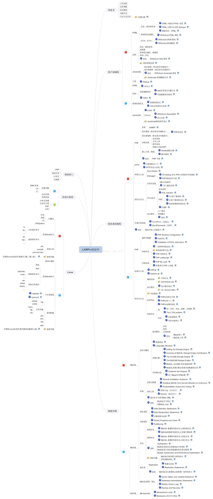

### 2、PHP编程知识总结
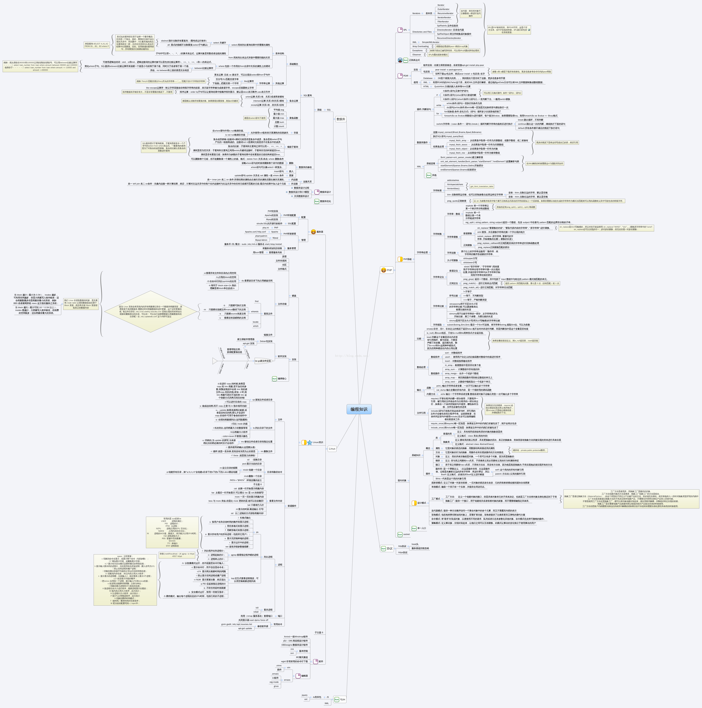

### 3、PHP面向对象编程（OOP）总结
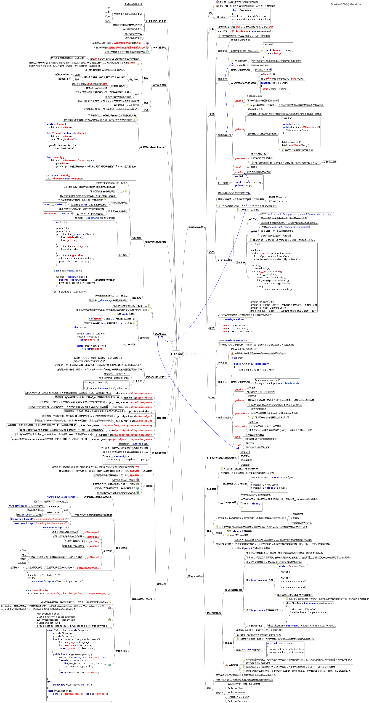

## 二 PHP语言基础思维导图
原文地址：[学习php的15张思维导图](https://blog.csdn.net/LuckyStar_D/article/details/88314400)

15 张思维导图来快速学习 PHP 语言基础

### 1、PHP 简介
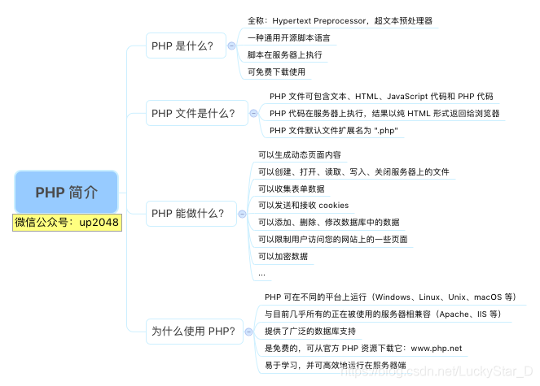

### 2、PHP 安装
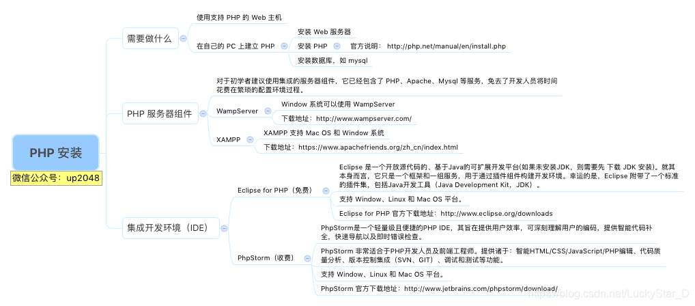

### 3、PHP 语法
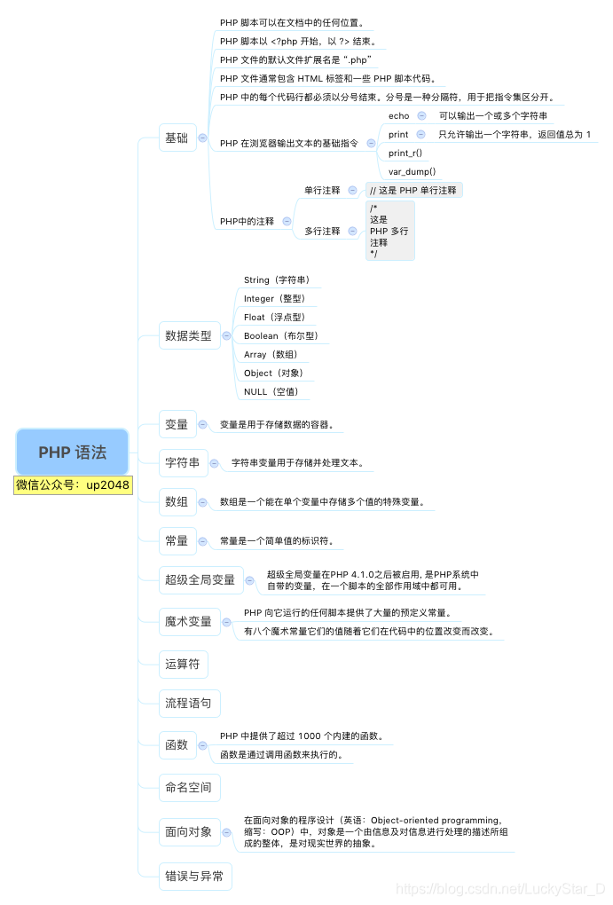

### 4、PHP 数据类型
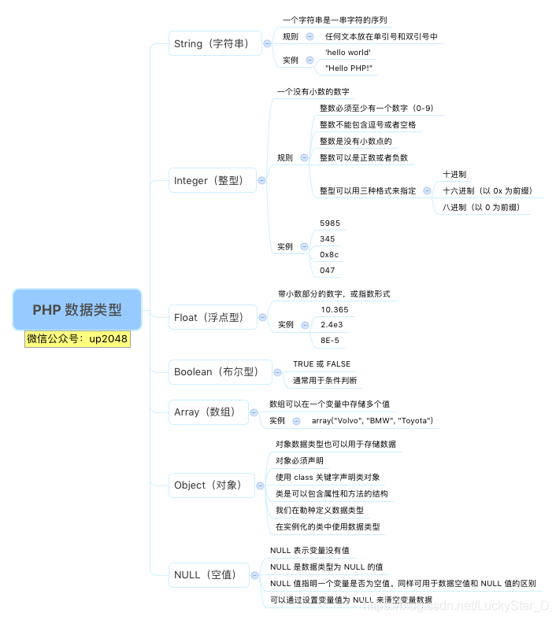

### 5、PHP 变量
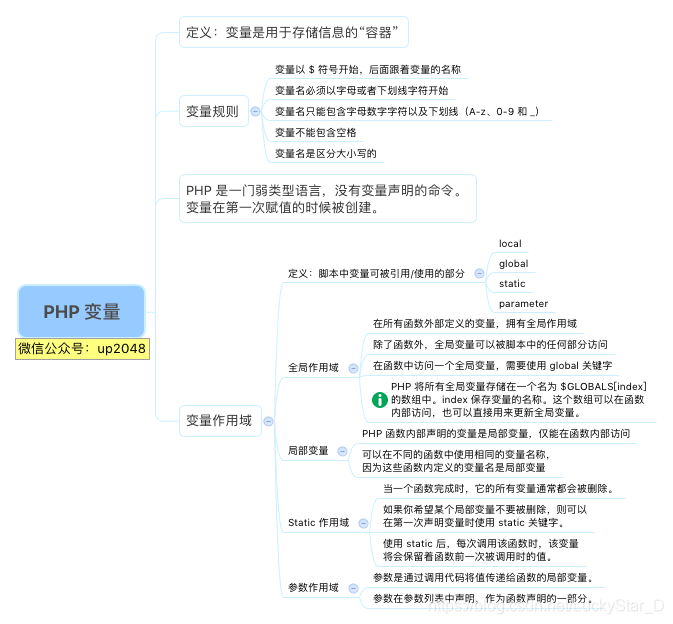

### 6、PHP 数组
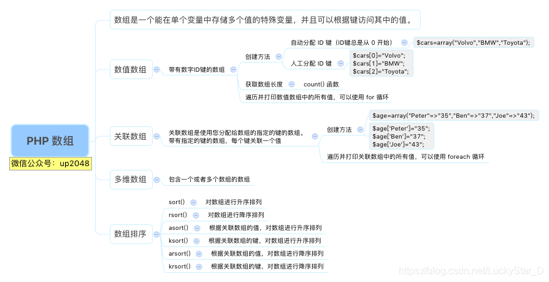

### 7、PHP 常量
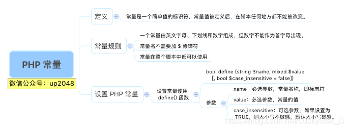

### 8、PHP 超级全局变量
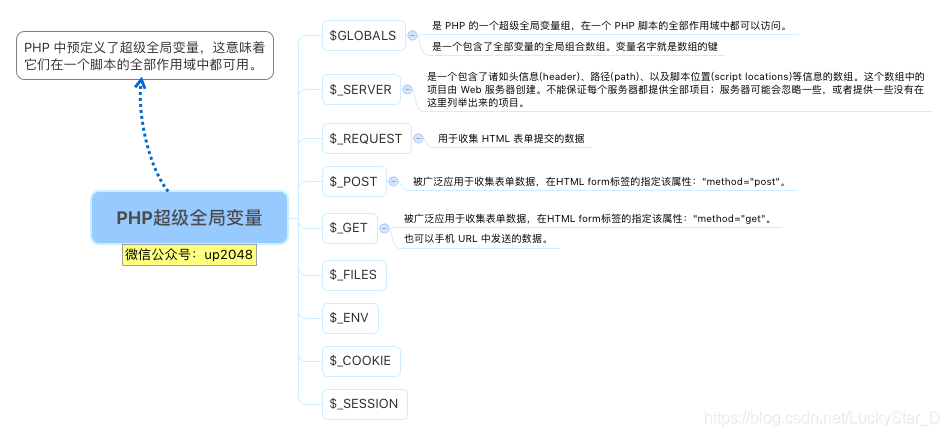

### 9、PHP魔术变量
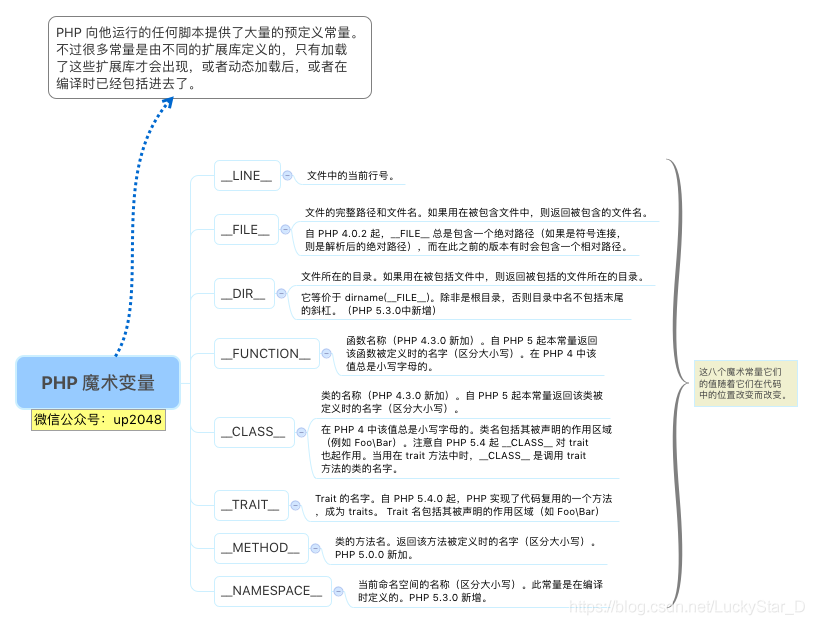

### 10、PHP运算符
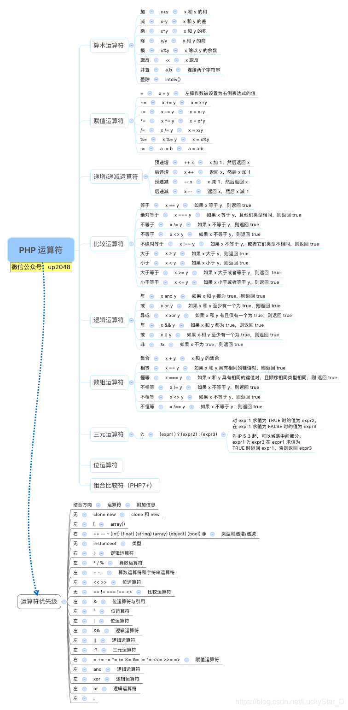

### 11、PHP流程语句
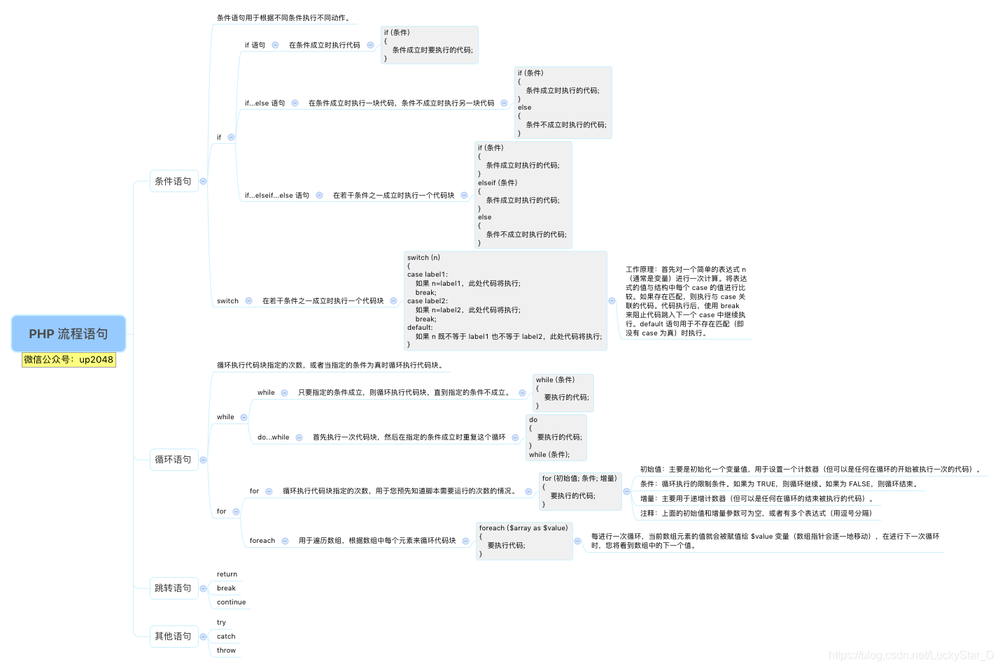

### 12、PHP函数
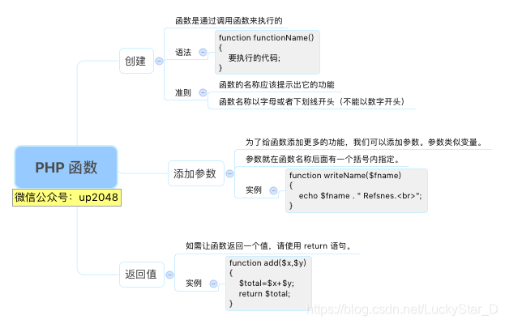

### 13、PHP命名空间
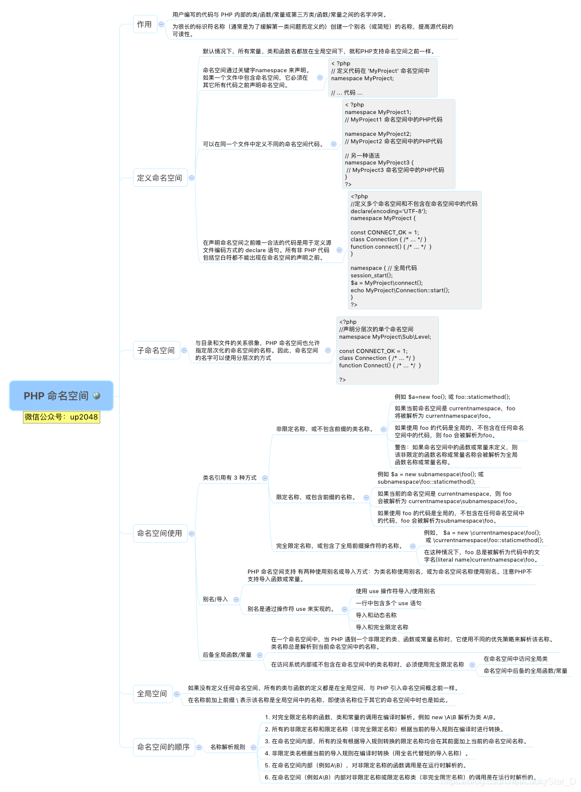

### 14、PHP面向对象
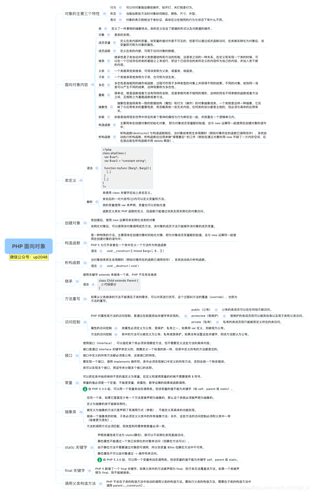

### 15、PHP错误与异常
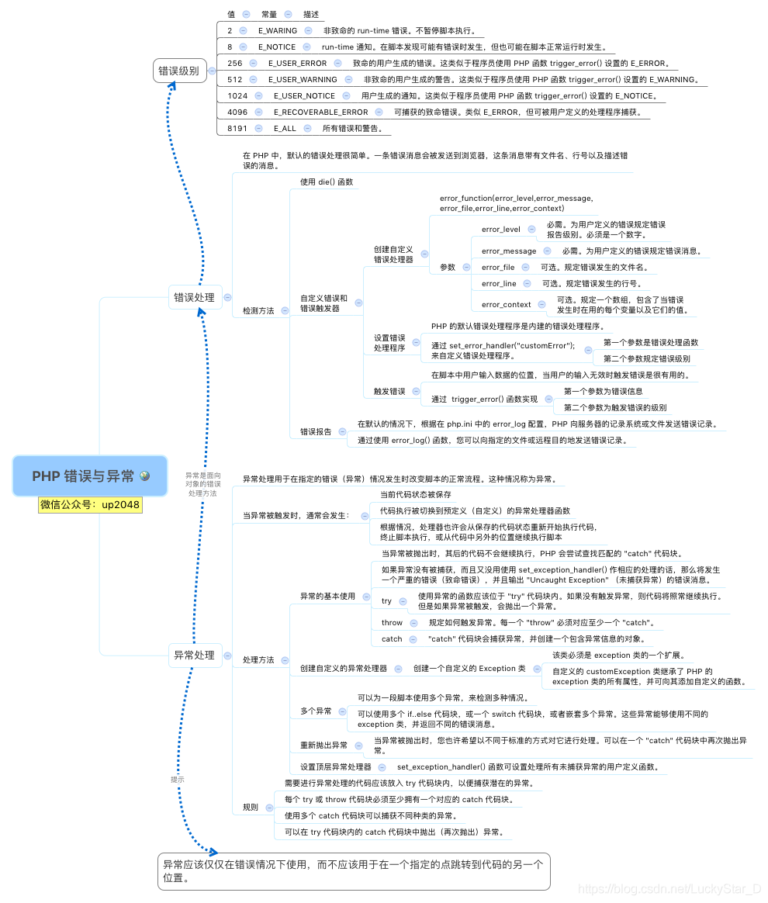
