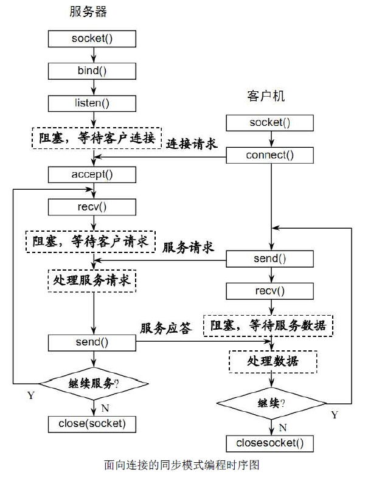

# 自我介绍 - PHP面试

面试官好！  
我叫XXX，主要写PHP，目前积累了5年的开发经验。
对 PHP、MySQL、Redis、HTML、JS、微信开发和 Linux 命令都比较熟悉。
之前也有从 0 到 1 完整参与和负责过项目开发，业务需求方面具备较好的理解能力和逻辑能力，也有组建过技术团队，具备较好的沟通协调能力。
今后希望能在南宁稳定工作。


介绍一下项目经历：

我就拿最近的一个项目来讲讲我的经历吧。

CalerieHealth 美商凯丽全球商城，主要售卖产品为保健品，面向的是全球用户，实现了中英双语切换。它具备国内常规商城的大部分功能，如 注册登录、商品展示、用户下单、订单支付、佣金分成、用户提现、即时通讯、售后服务等。  
也包含对一些数据的统计分析，如 用户分布情况，热销商品 一级 销售团队的佣金分配等。  
还实现了一套相对简单的仓库管理系统对接商城。

人员配置：
PHP 3个，一个前端，一个 UI
【注：需求都是从老板那出的】

会员 48万，每天活跃会员数量大概 1万，订单量 大概在 1000 单，最大并发量在 1300 左右，    
由于全球各地时间差异，各国白天黑夜时间不同，访问得以分流了，

促销怎么做？怎样应对大流量高并发？  
方案一：用预约（预售）的方式，将流量分散到不同的时间点。跟现在的腾讯云和阿里云一样，用户先预约，到时间了再告诉用户是否约到了，约到了就可以下单。

项目管理工具：
阿里新出的 teambition 里面有 需求管理和分派工具。

涉及的系统架构包括：
2台 ubuntu server 20.04  8核16G
2台 MySQL ：8核16G
1台Redis ：

涉及的技术包括：
后端：
- 使用 laravel 框架
- 使用了 NGINX 做了负载均衡
- 使用了 MySQL 的读写分离
- 用 Redis 做缓存
- 订单使用 Redis 队列
- 微信支付宝支付
- websocket 实现即时聊天
前端：vuejs


## laravel 服务容器的理解？
## nginx 负载均衡的理解？
## MySQL 读写分离的理解？
## Redis 缓存场景？
商品详情，用户登录，用户浏览商品埋点，
## Redis 队列应用？
## websocket 理解？



## Laravel 中的服务容器是什么
服务容器是用于在 Laravel 中执行依赖注入的工具。用于存储各种注入到容器中的类库对象，首先会经过绑定到容器，然后在通过反射机制获取里面的对象，或者的时候会根据绑定的类型进行判断，例如有类、闭包、实例对象。会根据类型进行获取。

IOC:控制反转，从容器获取相关对象就为控制反转。控制正转就是自己实例自己的对象，给自己使用。而有了容器，就是由它帮助我们完整创建对象的过程。

DI:依赖注入，例如A类需要B类提供的功能，它们就存在依赖关系，而注入只是把对象B交给对象A。

## 使用 laravel 有什么优势吗？
- Laravel 具有 blade 模板引擎，可创建动态布局并增加编译任务.
- 可以很简单的复用代码.
- 您不需要手动维护和包含路径，因为 Laravel 具有自动加载功能.
- 该框架可帮助您使用 LOC 容器制作新工具.
- Laravel 提供了一个版本控制系统，可帮助简化迁移管理.


## 二.memcache 和 Redis 的区别
- 数据结构：memcache仅支持简单的key-value形式，Redis支持的数据更多（string字符串，set集合，list列表，hash散列，zset有序集合）；
- 多线程：memcache支持多线程，Redis支持单线程
- 持久化：Redis支持持久化，memcache不支持持久化
- 分布式：Redis做主从结构，memcache服务器需要通过hash一致化来支撑主从结构

实际运用中可以redis，memcache结合，memcache可作为session存储的方式，session都是KV类型键值对。

1. Redis中，并不是所有的数据都一直存储在内存中的，这是和Memcache相比一个最大的区别。
1. Redis在很多方面具备数据库的特征，或者说就是一个数据库系统，而Memcache只是简单的K/V缓存。
1. 他们的扩展都需要做集群；实现方式：master-slave、Hash。
1. 在100k以上的数据中，Memcache性能要高于Redis。
1. 如果要说内存使用效率，使用简单的key-value存储的话，Memcached的内存利用率更高，而如果Redis采用hash结构来做key-value存储，由于其组合式的压缩，其内存利用率会高于Memcache。当然，这和你的应用场景和数据特性有关。
1. 如果你对数据持久化和数据同步有所要求，那么推荐你选择Redis，因为这两个特性Memcache都不具备。即使你只是希望在升级或者重启系统后缓存数据不会丢失，选择Redis也是明智的。
1. Redis和Memcache在写入性能上面差别不大，读取性能上面尤其是批量读取性能上面Memcache更强
1. Redis 提供了多种不同级别的持久化方式：
    ```
    RDB 持久化可以在指定的时间间隔内生成数据集的时间点快照（point-in-time snapshot）。
    AOF 持久化记录服务器执行的所有写操作命令，并在服务器启动时，通过重新执行这些命令来还原数据集。 AOF 文件中的命令全部以 Redis 协议的格式来保存，新命令会被追加到文件的末尾。 Redis 还可以在后台对 AOF 文件进行重写（rewrite），使得 AOF 文件的体积不会超出保存数据集状态所需的实际大小。
    Redis 还可以同时使用 AOF 持久化和 RDB 持久化。 在这种情况下， 当 Redis 重启时， 它会优先使用 AOF 文件来还原数据集， 因为 AOF 文件保存的数据集通常比 RDB 文件所保存的数据集更完整。
    你甚至可以关闭持久化功能，让数据只在服务器运行时存在。
    ```