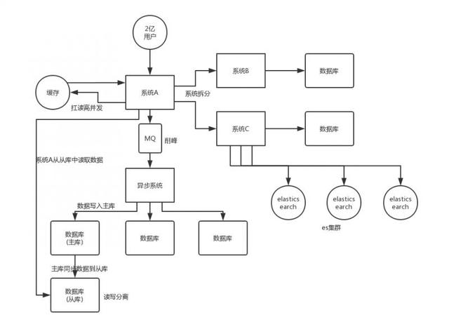

# 专题
## PHP
### 基础知识
#### get 和 post 的区别
- Get 方法允许在请求头部 (header) 中发送有限数量的数据。Post 允许在正文中发送大量数据。
- GET在浏览器回退时是无害的，而POST会再次提交请求。
- GET产生的URL地址可以被Bookmark，而POST不可以。
- GET请求会被浏览器主动cache，而POST不会，除非手动设置。
- GET请求只能进行url编码，而POST支持多种编码方式。
- GET请求参数会被完整保留在浏览器历史记录里，而POST中的参数不会被保留。
- GET请求在URL中传送的参数是有长度限制的，而POST没有。
- 对参数的数据类型，GET只接受ASCII字符，而POST没有限制。
- GET比POST更不安全，因为参数直接暴露在URL上，所以不能用来传递敏感信息。
- GET参数通过URL传递，POST放在Request body中。
- GET产生一个TCP数据包，POST产生两个TCP数据包
#### require 和 include 区别
- require是无条件包含，也就是如果一个流程里加入require,无论条件成立与否都会先执行require
- include有返回值，而require没有(可能因为如此require的速度比include快) 
- 包含文件不存在或者语法错误的时候require是致命的错误终止执行,include不是
#### PHP字符串中单引号与双引号的区别?
- 单引号不能解释变量，而双引号可以解释变量。
- 单引号不能转义字符，在双引号中可以转义字符。
#### PHP 的垃圾回收机制
- PHP 可以自动进行内存管理，清除不需要的对象。
- PHP 使用了引用计数 (reference counting) GC 机制。
- 每个对象都内含一个引用计数器 refcount，每个 reference 连接到对象，计数器加 1。当 reference 离开生存空间或被设为 NULL，计数器减 1。当某个对象的引用计数器为零时，PHP 知道你将不再需要使用这个对象，释放其所占的内存空间。
#### 谈谈对mvc的认识
- 由模型(model)，视图(view)，控制器(controller)完成的应用程序。
- model层负责提供数据，和数据库有关的操作都交给模型层来处理，
- view层则提供交互的界面，并输出数据，
- controller层则负责接收请求，并分发给相应的model来处理，然后调用view层来显示。
#### PHP如何实现页面跳转
- php函数跳转，缺点，header头之前不能有输出，跳转后的程序继续执行，可用exit中断执行后面的程序。`header("Location:网址");//直接跳转`
- 利用meta：`echo"<meta http-equiv=refresh content='0;url=网址'>";`
#### PHP如何获得一个数组的键值
- 使用key()可以获得数组中当前元素的键名，使用current()则可以返回当前元素的值。
- 使用array_keys()则可以得到数组中所有的键名。
- 使用foreach结构foreach($arr as value)可以通过value分别获取键名和值。
#### isset() 和 empty() 区别
- Isset判断变量是否存在，可以传入多个变量，若其中一个变量不存在则返回假，
- empty判断变量是否为空为假，只可传一个变量，如果为空为假则返回真。
#### 请说明 PHP 中传值与传引用的区别。什么时候传值什么时候传引用？
- 按值传递：函数范围内对值的任何改变在函数外部都会被忽略
- 按引用传递：函数范围内对值的任何改变在函数外部也能反映出这些修改
- 优缺点：按值传递时，php必须复制值。特别是对于大型的字符串和对象来说，这将会是一个代价很大的操作。按引用传递则不需要复制值，对于性能提高很有好处。
#### php读取文件内容的几种方法和函数？
- 打开文件，然后读取。Fopen() fread()
- 打开读取一次完成 file_get_contents()
#### 用PHP写出显示客户端IP与服务器IP的代码
- 获取客户端IP：`$_SERVER(“REMOTE_ADDR”);`
- 获取服务器端IP：`$_SERVER["SERVER_ADDR"];`
#### 说说你对缓存技术的了解？
- 1、缓存技术是将动态内容缓存到文件中，在一定时间内访问动态页面直接调用缓存文件，而不必重新访问数据库。
- 2、使用 memcache 或 Redis 可以做缓存。
#### 常用的PHP扩展
- mb_sring
- iconv
- curl
- GD
- XML
- socket
- MySQL
- PDO
#### 一个字节占多少bit ? 一个IPv4地址占几个字节? 一个IPv6地址呢?
- 一个字节占8bit，一个IPV4占用4字节，一个IPV6占用16字节。
#### 什么事面向对象？主要特征是什么？
- 面向对象是程序的一种设计方式，它利于提高程序的重用性，使程序结构更加清晰。
- 主要特征：封装、继承、多态。
#### 面向对象中接口和抽象类的区别及应用场景?
- 1、有抽象方法的类叫做抽象类，抽象类中不一定只有抽象方法，抽象方法必须使用abstract关键字定义。
- 2、接口中全部是抽象方法,方法不用使用abstract定义。
- 3、当多个同类的类要设计一个上层，通常设计为抽象类，当多个异构的类要设计一个上层，通常设计为接口。
#### SESSION 与 COOKIE的区别是什么，请从协议，产生的原因与作用说明?
- 1、http无状态协议，不能区分用户是否是从同一个网站上来的，同一个用户请求不同的页面不能看做是同一个用户。
- 2、SESSION存储在服务器端，COOKIE保存在客户端。Session比较安全，cookie用某些手段可以修改，不安全。Session依赖于cookie进行传递。
- 3、禁用cookie后，session不能正常使用。
- 4、Session的缺点：保存在服务器端，每次读取都从服务器进行读取，对服务器有资源消耗。Session保存在服务器端的文件或数据库中，默认保存在文件中，文件路径由php配置文件的session.save_path指定。Session文件是公有的。
#### HTTP 状态中302、403、 500代码含义？
- 一二三四五原则: 
    - 一. 消息系列 
    - 二 成功系列 
    - 三. 重定向系列 
    - 四. 请求错误系列 
    - 五. 服务器端错误系列
- 302:临时转移成功，请求的内容已转移到新位置 
- 403:禁止访问 
- 500:服务器内部错误
- 401代表未授权。
#### 你所知道的设计模式有哪些？
- 工厂模式
- 策略模式
- 单元素模式
    - MySQL 操作类
    - 发邮件类
    - 消息推送类
- 观察者模式
- 命令链模式
#### 对于大流量的网站,您采用什么样的方法来解决访问量问题?
- 优化程序，优化数据库，如果程序和数据库已经最优化，使用以下解决方法：
- 1、确定当前服务器设备是否满足流量需求。
- 2、使用Memcache缓存技术，把动态内容缓存到文件中，动态网页直接调用这些文件，而不必再访问数据库。
- 3、禁止外部盗链，图片和文件外部盗链会给服务器带来大量的负载压力，可以通过refer来禁止外部盗链，或者使用apache来配置禁止盗链。
- 4、控制大文件的下载，大文件的下载对于非SCSI硬盘来说会占用大量的资源，导致服务器的响应能力下降。
- 5、使用不同的主机分流主要流量，使服务器均衡负载。
- 6、使用流量统计软件统计分析网站流量，可以知道哪些地方耗费了大量的流量，哪些页面需要再进行优化。（对具体页面进行针对性分析优化）
#### 了解XSS攻击吗? 如何防止 ?
- XSS是跨站脚本攻击，首先是利用跨站脚本漏洞以一个特权模式去执行攻击者构造的脚本，然后利用不安全的Activex控件执行恶意的行为。
- 使用 htmlspecialchars() 函数对提交的内容进行过滤，使字符串里面的特殊符号实体化。
#### SQL注入漏洞产生的原因 ? 如何防止?
- SQL注入产生的原因：程序开发过程中不注意规范书写sql语句和对特殊字符进行过滤，导致客户端可以通过全局变量POST和GET提交一些sql语句正常执行。
- 防止SQL注入：
    - 1、开启配置文件中的magic_quotes_gpc和magic_quotes_runtime设置
    - 2、执行sql语句时使用addslashes进行sql语句转换
    - 3、Sql语句书写尽量不要省略小引号和单引号
    - 4、过滤掉sql语句中的一些关键字：update、insert、delete、select、*
    - 5、提高数据库表和字段的命名技巧，对一些重要的字段根据程序的特点命名，取不易被猜到的。
    - 6、Php配置文件中设置register_globals为off，关闭全局变量注册
    - 7、控制错误信息，不要在浏览器上输出错误信息，将错误信息写到日志文件中。
### 函数
- array()----创建数组
- array_merge()----把两个或多个数组合并成一个数组
- array_slice()----在数组中根据条件取出一段值
- array_diff()----返回两个数组的差集数组
- array_search()----在数组中搜索给定的值
- array_splice()----移除数组的一部分且替代它
- array_key_exists()----判断某个数组中是否存在指定的key
- array_unique()----移除数组中重复的值
- array_push()
- array_pop()
- array_keys()
- array_culomns()
- array_chunk()----将一个数组分割成多个
- array_combine()----通过合并两个数组来创建一个新数组
- array_flip()----交换数组中的键和值
- array_reverse()----将原数组中的元素顺序翻转，创建新的数组并返回
- shuffle()----把数组中的元素按随机顺序重新排列
- range()----创建并返回一个包含指定范围的元素的数组
- compact()----建立一个数组
- array_intersect()----计算数组的交集
### PHP 魔术方法
- __call()当调用不存在的方法时会自动调用的方法
- __autoload()在实例化一个尚未被定义的类是会自动调用次方法来加载类文件
- __set()当给未定义的变量赋值时会自动调用的方法
- __get()当获取未定义变量的值时会自动调用的方法
- __construct()构造方法，实例化类时自动调用的方法
- __destroy()销毁对象时自动调用的方法
- __unset()当对一个未定义变量调用unset()时自动调用的方法
- __isset()当对一个未定义变量调用isset()方法时自动调用的方法
- __clone()克隆一个对象
- __tostring()当输出一个对象时自动调用的方法
### PHP 预定义变量
- $_REQUEST用来获取post或get方式提交的值
- $_POST用来获取post方式提交的值
- $_GET用来获取get方式提交的值
- $_COOKIE用来获取cookie存储的值
- $_SESSION用来获取session存储的值
- $_FILES用来获取上传文件表单的值

### 常见排序算法
- 冒泡排序
    - 在要排序的一组数中，对当前还未排好的序列，从前往后对相邻的两个数依次进行比较和调整，让较大的数往下沉，较小的往上冒。即，每当两相邻的数比较后发现它们的排序与排序要求相反时，就将它们互换。
- 选择排序
    - 在要排序的一组数中，选出最小的一个数与第一个位置的数交换。然后在剩下的数当中再找最小的与第二个位置的数交换，如此循环到倒数第二个数和最后一个数比较为止。
- 插入排序
    - 在要排序的一组数中，假设前面的数已经是排好顺序的，现在要把第n个数插到前面的有序数中，使得这n个数也是排好顺序的。如此反复循环，直到全部排好顺序。
- 快速排序
    - 选择一个基准元素，通常选择第一个元素或者最后一个元素。通过一趟扫描，将待排序列分成两部分，一部分比基准元素小，一部分大于等于基准元素。此时基准元素在其排好序后的正确位置，然后再用同样的方法递归地排序划分的两部分。
### 框架
#### Laravel
- 服务容器
- 事件
- 设计模式
- ORM 对应关系
  - 一对一
  - 一对多
  - 多对一
  - 多对多
#### ThinkPHP
#### Ci（CodeIgniter）
#### Yii
## MySQL
### MySQL 基础
#### MyISAM 和 InnoDB 的基本区别？索引结构如何实现？
- MyISAM类型不支持事务，表锁，易产生碎片，要经常优化，读写速度较快，
- 而InnoDB类型支持事务，行锁，有崩溃恢复能力。读写速度比MyISAM慢。
- 创建索引：`alert table tablename add index (字段名);`
#### web应用中,数据库的读取频率远高于写入频率, 如何优化MySQL而应对此种情景?
- 缓存高频读取的数据。使用memcache缓存技术，将动态数据缓存到文件，访问动态页面时直接调用缓存文件，而不必重新访问数据库，这样就减少了查询数据库的次数。
- MySQL读写分离。如果网站的访问量很大，可以把数据库读写服务器分开，使用多台服务器去处理数据库查询，使用较少的服务器去处理数据库的写入和修改。
### 数据类型
#### 数值类型
- TINYINT：1 Bytes，(-128，127)，	(0，255)，	小整数值
- SMALLINT：	2 Bytes，	(-32 768，32 767)，	(0，65 535)，	大整数值
- MEDIUMINT	：3 Bytes，	(-8 388 608，8 388 607)，	(0，16 777 215)	，大整数值
- INT或INTEGER：	4 Bytes，	(-2 147 483 648，2 147 483 647)，	(0，4 294 967 295)，	大整数值
- BIGINT：	8 Bytes，	(-9,223,372,036,854,775,808，9 223 372 036 854 775 807)，	(0，18 446 744 073 709 551 615)，	极大整数值 
- FLOAT	：4 Bytes	；(-3.402 823 466 E+38，-1.175 494 351 E-38)，0，(1.175 494 351 E-38，3.402 823 466 351 E+38)；	0，(1.175 494 351 E-38，3.402 823 466 E+38)	；单精度浮点数值
- DOUBLE：	8 Bytes；	(-1.797 693 134 862 315 7 E+308，-2.225 073 858 507 201 4 E-308)，0，(2.225 073 858 507 201 4 E-308，1.797 693 134 862 315 7 E+308)；	0，(2.225 073 858 507 201 4 E-308，1.797 693 134 862 315 7 E+308)	；双精度浮点数值
- DECIMAL：	对DECIMAL(M,D) ，如果M>D，为M+2否则为D+2；	依赖于M和D的值；	依赖于M和D的值；	小数值
#### 日期和时间类型
- DATE：	3 bytes，	1000-01-01/9999-12-31，	YYYY-MM-DD，	日期值
- TIME：	3 bytes，	'-838:59:59'/'838:59:59'	HH:MM:SS	时间值或持续时间
- YEAR：	1 bytes，	1901/2155	YYYY	年份值
- DATETIME：	8 bytes；	1000-01-01 00:00:00/9999-12-31 23:59:59 ；	YYYY-MM-DD HH:MM:SS	；混合日期和时间值
- TIMESTAMP：	4 bytes；1970-01-01 00:00:00/2038 ，结束时间是第 2147483647 秒，北京时间 2038-1-19 11:14:07，格林尼治时间 2038年1月19日 凌晨 03:14:07 ；YYYYMMDD HHMMSS；	混合日期和时间值，时间戳
#### 字符串类型
- CHAR：	0-255 bytes，	定长字符串。固定长度的字符类型，分配多少空间，就占用多长空间。
- VARCHAR：	0-65535 bytes，	变长字符串。内容有多大就占用多大的空间，能有效节省空间。由于varchar类型是可变的，所以在数据长度改变的时，服务器要进行额外的操作，所以效率比char类型低。
- TINYBLOB：	0-255 bytes，	不超过 255 个字符的二进制字符串
- TINYTEXT：	0-255 bytes	，短文本字符串
- BLOB：	0-65 535 bytes，	二进制形式的长文本数据
- TEXT：	0-65 535 bytes，	长文本数据
- MEDIUMBLOB：	0-16 777 215 bytes，	二进制形式的中等长度文本数据
- MEDIUMTEXT：	0-16 777 215 bytes，	中等长度文本数据
- LONGBLOB：	0-4 294 967 295 bytes，	二进制形式的极大文本数据
- LONGTEXT：	0-4 294 967 295 bytes，	极大文本数据
### MySQL 索引
#### 索引类型
- 普通索引
- 唯一索引
- 主键索引
#### 索引的目的
- 1、快速访问数据表中的特定信息，提高检索速度
- 2、创建唯一性索引，保证数据库表中每一行数据的唯一性
- 3、加速表和表之间的连接
- 4、使用分组和排序子句进行数据检索时，可以显著减少查询中分组和排序的时间
#### 索引对数据库系统的负面影响
- 创建索引和维护索引需要耗费时间，这个时间随着数据量的增加而增加；
- 索引需要占用物理空间，不光是表需要占用数据空间，每个索引也需要占用物理空间；
- 当对表进行增、删、改的时候索引也要动态维护，这样就降低了数据的维护速度。
#### 为数据表建立索引的原则有哪些?
- 1、在最频繁使用的、用以缩小查询范围的字段上建立索引
- 2、在最频繁使用的、需要排序的字段上建立索引
#### 什么情况下不宜建立索引?
- 1、对于查询中很少涉及的列或者重复值比较多的列，不宜建立索引
- 2、对于一些特殊的数据类型，不宜建立索引，比如文本字段(text)，值范围较少的字段等。
### MySQL 存储引擎
#### InnoDB
- MySQL5.5之后的默认存储引擎，提供了具有提交，回滚和崩溃恢复能力的事务安全保障，
- 同时提供了更小的锁粒度和更强的并发能力，拥有自己独立的缓存和日志。
- 但是对比MyISAM的存储引擎，InnoDB写的处理效率差一些，并且会占用更多的磁盘空间以保留数据和索引。
#### MyISAM
- mysql5.5之前的默认存储引擎，不支持事务，也不支持外键，
- 每个MyISAM在磁盘上存储成3个文件，其文件名都和表名相同，但拓展名分别是
    - .frm(存储表定义)
    - .MYD(MYData，存储数据);
    - .MYI(MYIndex，存储索引)
- 数据文件和索引文件可以放置在不同的目录，平均分布IO，获得更快的速度。
- MyISAM的表还支持3种不同的存储格式
    - 静态表(固定长度)表(默认的存储格式)
    - 动态表
    - 压缩表

#### BDB：
#### MEMORY
- 将表的数据存放在内存中。
- 每个MEMORY表实际对应一个磁盘文件，格式是.frm。
- .frm 文件中只存储表的结构，而其数据文件，都是存储在内存中，这样有利于数据的快速处理，提高整个表的效率。
- MEMORY 类型的表访问非常地快，因为他的数据是存放在内存中的，并且默认使用HASH索引，但是服务一旦关闭，表中的数据就会丢失。
#### MERGE
- MERGE存储引擎是一组MyISAM表的组合，这些MyISAM表必须结构完全相同。
- MERGE表本身并没有存储数据，对MERGE类型的表可以进行查询、更新、删除操作，这些操作实际上是对内部的MyISAM表进行的。
#### EXAMPLE：
#### NDB Cluster：
#### ARCHIVE：
#### CSV：
#### BLACKHOLE：
#### FEDERATED：
### MySQL 存储引擎的选择
- InnoDB : 是Mysql的默认存储引擎，用于事务处理应用程序，支持外键。如果应用对事务的完整性有比较高的要求，在并发条件下要求数据的一致性，数据操作除了插入和查询以外，还包含很多的更新、删除操作，那么InnoDB存储引擎是比较合适的选择。InnoDB存储引擎除了有效的降低由于删除和更新导致的锁定， 还可以确保事务的完整提交和回滚，对于类似于计费系统或者财务系统等对数据准确性要求比较高的系统，InnoDB是最合适的选择。
- MyISAM ： 如果应用是以读操作和插入操作为主，只有很少的更新和删除操作，并且对事务的完整性、并发性要求不是很高，那么选择这个存储引擎是非常合适的。
- MEMORY：将所有数据保存在RAM中，在需要快速定位记录和其他类似数据环境下，可以提供几块的访问。MEMORY的缺陷就是对表的大小有限制，太大的表无法缓存在内存中，其次是要确保表的数据可以恢复，数据库异常终止后表中的数据是可以恢复的。MEMORY表通常用于更新不太频繁的小表，用以快速得到访问结果。
- MERGE：用于将一系列等同的MyISAM表以逻辑方式组合在一起，并作为一个对象引用他们。MERGE表的优点在于可以突破对单个MyISAM表的大小限制，并且通过将不同的表分布在多个磁盘上，可以有效的改善MERGE表的访问效率。这对于存储诸如数据仓储等VLDB环境十分合适。
### MySQL 优化
#### 优化 MYSQL 数据库的方法（一）
- (1) 选取最适用的字段属性，尽可能减少定义字段长度，尽量把字段设置 NOT NULL, 例如’省份，性别’, 最好设置为 ENUM
- (2) 使用连接（JOIN）来代替子查询:
- (3) 使用联合 (UNION) 来代替手动创建的临时表
- (4) 事务处理:
- (5) 锁定表，优化事务处理:
- (6) 使用外键，优化锁定表
- (7) 建立索引
- (8) 优化 sql 语句
#### 优化 MYSQL 数据库的方法（二）
- (1). 数据库设计方面，设计结构良好的数据库，必要的时候，允许部分数据冗余，避免 JOIN 操作，以提高查询效率
- (2). 系统架构设计方面，表散列，把海量数据散列到几个不同的表里面。快慢表，快表只留最新数据，慢表是历史存档。集群，主服务器 Read & write, 从服务器 read only, 或者 N 台服务器，各机器互为 Master
- (3).检查有没有少加索引
- (4). 写高效的 SQL 语句，看看有没有写低效的 SQL 语句，比如大量的 Group By 和 order by, 没有 limit 等等。必要的时候，把数据库逻辑封装到 DBMS 端的存储过程里面。缓存查询结果，explain 每一个 sql 语句
- (5). 只从数据库取必需的数据
- (6). 选择合适的存储引擎。比如 InnoDB 可以减少死锁，对事务有要求的使用 Innodb；对登录日志类的数据，用 myisam。
#### SQL 语句优化
- Where子句中：where表之间的连接必须写在其他Where条件之前，那些可以过滤掉最大数量记录的条件必须写在Where子句的末尾.HAVING最后。
- 用EXISTS替代IN、用NOT EXISTS替代NOT IN。
- 避免在索引列上使用计算
- 避免在索引列上使用IS NULL和IS NOT NULL
- 对查询进行优化，应尽量避免全表扫描，首先应考虑在 where 及 order by 涉及的列上建立索引。
- 应尽量避免在 where 子句中对字段进行 null 值判断，否则将导致引擎放弃使用索引而进行全表扫描
- 应尽量避免在 where 子句中对字段进行表达式操作，这将导致引擎放弃使用索引而进行全表扫描
### 数据库三范式
- 第一范式：1NF是对属性的原子性约束，要求属性具有原子性，不可再分解；
- 第二范式：2NF是对记录的惟一性约束，要求记录有惟一标识，即实体的惟一性；
- 第三范式：3NF是对字段冗余性的约束，即任何字段不能由其他字段派生出来，它要求字段没有冗余。
### Mysql 中有哪几种锁
- MyISAM支持表锁，InnoDB支持表锁和行锁，默认为行锁
- 表级锁：开销小，加锁快，不会出现死锁。锁定粒度大，发生锁冲突的概率最高，并发量最低
- 行级锁：开销大，加锁慢，会出现死锁。锁力度小，发生锁冲突的概率小，并发度最高
## Redis
### memcache 和 Redis 的区别
- 数据结构：memcache仅支持简单的key-value形式，Redis支持的数据更多（string字符串，set集合，list列表，hash散列，zset有序集合）；
- 多线程：memcache支持多线程，Redis支持单线程
- 持久化：Redis支持持久化，memcache不支持持久化
- 分布式：Redis做主从结构，memcache服务器需要通过hash一致化来支撑主从结构
### redis 消息队列先进先出需要注意什么？
- 通常用Redis的list来实现队列操作，要注意任务的优先级处理
- Redis 队列的优先级的两个操作方法：
    - 单一列表实现：队列正常的操作是 左进右出（lpush,rpop）为了先处理高优先级任务，在遇到高级别任务时，可以直接插队，直接放入队列头部（rpush），这样，从队列头部（右侧）获取任务时，取到的就是高优先级的任务（rpop）
    - 两个队列实现：一个普通队列，一个高级队列，先处理高优先级任务，当没有高优先级任务时，就去获取普通任务。针对任务的级别放入不同的队列，获取任务时也很简单，redis的BRPOP命令可以按顺序从多个队列中取值，BRPOP会按照给出的 key 顺序查看，并在找到的第一个非空 list 的尾部弹出一个元素
### Redis 如何防止高并发？
#### 出现高并发的原因
- Redis 客户端链接混乱产生：Redis是一种单线程机制的nosql数据库，基于key-value，数据可持久化落盘。由于单线程所以redis本身并没有锁的概念，多个客户端连接并不存在竞争关系，但是利用jedis等客户端对redis进行并发访问时会出现问题，如连接超时、数据转换错误、阻塞、客户端关闭连接等。
- 并发访问量大，因网络等原因，可能造成访问延迟返回或后来的请求超时
#### 解决办法
- 在客户端将连接进行池化，同时对客户端读写Redis操作采用内部锁synchronized。
- 服务器角度，利用setnx变向实现锁机制。
### [Redis 性能优化的 13 条军规大全](https://zhuanlan.zhihu.com/p/134314240)
#### 1.缩短键值对的存储长度
#### 2.使用 lazy free 特性
#### 3.设置键值的过期时间
#### 4.禁用长耗时的查询命令
- 决定禁止使用 keys 命令
- 避免一次查询所有的成员，要使用 scan 命令进行分批的，游标式的遍历
- 通过机制严格控制 Hash、Set、Sorted Set 等结构的数据大小
- 将排序、并集、交集等操作放在客户端执行，以减少 Redis 服务器运行压力
- 删除 (del) 一个大数据的时候，可能会需要很长时间，所以建议用异步删除的方式 unlink，它会启动一个新的线程来删除目标数据，而不阻塞 Redis 的主线程
#### 5.使用 slowlog 优化耗时命令
#### 6.使用 Pipeline 批量操作数据
#### 7.避免大量数据同时失效
#### 8.客户端使用优化
#### 9.限制 Redis 内存大小
#### 10.使用物理机而非虚拟机
#### 11.检查数据持久化策略
#### 12.禁用 THP 特性
#### 13.使用分布式架构来增加读写速度
- 主从同步
- 哨兵模式
- Redis Cluster 集群

### Redis 内存淘汰策略
- noeviction：不淘汰任何数据，当内存不足时，新增操作会报错，Redis 默认内存淘汰策略
- allkeys-lru：淘汰整个键值中最久未使用的键值
- allkeys-lfu：淘汰整个键值中最少使用的键值
- allkeys-random：随机淘汰任意键值
- volatile-lru：淘汰所有设置了过期时间的键值中最久未使用的键值
- volatile-lfu：淘汰所有设置了过期时间的键值中，最少使用的键值
- volatile-random：随机淘汰设置了过期时间的任意键值
- volatile-ttl：优先淘汰更早过期的键值
### Redis 3 种持久化方式
- RDB（Redis DataBase，快照方式）：将某一个时刻的内存数据，以二进制的方式写入磁盘
- AOF（Append Only File，文件追加方式）：记录所有的操作命令，并以文本的形式追加到文件中
- 混合持久化方式：Redis 4.0 之后新增的方式，混合持久化是结合了 RDB 和 AOF 的优点，在写入的时候，先把当前的数据以 RDB 的形式写入文件的开头，再将后续的操作命令以 AOF 的格式存入文件，这样既能保证 Redis 重启时的速度，又能减低数据丢失的风险。
## Memcache
### memcache 基础
#### 你对Memcach的理解，优点有哪些？
- Memcache是一种缓存技术，在一定的时间内将动态网页经过解析之后保存到文件，下次访问时动态网页就直接调用这个文件，而不必在重新访问数据库。
- 使用memcache做缓存的好处是：提高网站的访问速度，减轻高并发时服务器的压力。
- Memcache的优点：稳定、配置简单、多机分布式存储、速度快。
## MongoDB
## ClickHouse
## Git
### 常用命令
- git init : 初始化本地仓库
- git diff filename ：对比本地文件修改
- git add -A
- git commit -m '备注'
- git remote add origin {url} ：添加远程仓库
- git push -u origin master ：首次向远程仓库推送代码
- git push origin master ：向远程仓库推送代码
## Composer
### Composer aotuload 的原理
- composer 加载核心思想是通过 composer 的配置文件在引用入口文件 (autoload.php) 时，将类和路径的对应关系加载到内存中，最后将具体加载的实现注册到 spl_autoload_register 函数中。最后将需要的文件包含进来。
### composer install
- 安装 composer.lock 文件内对应的扩展包
### composer update
- 将 composer.json 文件内对应的扩展包更新
## Linux
### 命令大全
#### 1、文件管理
- cat
- chmod
- chown
- find
- mv
- rm
- touch
- cp
#### 2、文档编辑
#### 3、文件传输
#### 4、磁盘管理
- cd
- df
- mkdir：创建目录
- pwd：显示工作目录
- ls
- ll
#### 5、磁盘维护
#### 6、网络通讯
#### 7、系统管理
#### 8、系统设置
#### 9、备份压缩
#### 10、设备管理
### 其他命令
#### Linux bc 命令
#### Linux tail 命令
#### Linux head 命令
#### Linux xargs 命令
#### Linux ip 命令
#### Linux nohup 命令
#### Linux killall 命令
#### Linux pkill 命令
## Nginx
## Http
### HTTP 状态码分类
- HTTP 状态码由三个十进制数字组成，第一个十进制数字定义了状态码的类型。
- 响应分为五类：
    - 信息响应(100–199)，
    - 成功响应(200–299)，
    - 重定向(300–399)，
    - 客户端错误(400–499)，
    - 服务器错误 (500–599)。
### http 状态码（HTTP Status Code）
- 200 - 请求成功
- 301 - 资源（网页等）被永久转移到其它URL
- 400 -	Bad Request，	客户端请求的语法错误，服务器无法理解
- 401 -	Unauthorized，	请求要求用户的身份认证
- 403 -	Forbidden，	服务器理解请求客户端的请求，但是拒绝执行此请求
- 404 - Not Found，请求的资源（网页等）不存在
- 413 -	Request Entity Too Large，	由于请求的实体过大，服务器无法处理，因此拒绝请求。为防止客户端的连续请求，服务器可能会关闭连接。如果只是服务器暂时无法处理，则会包含一个Retry-After的响应信息
- 500 -	Internal Server Error，	服务器内部错误，无法完成请求
- 502 -	Bad Gateway，	作为网关或者代理工作的服务器尝试执行请求时，从远程服务器接收到了一个无效的响应
- 504 -	Gateway Time-out，	充当网关或代理的服务器，未及时从远端服务器获取请求
## 高并发
### [设计一个高并发系统](https://blog.csdn.net/weixin_39996035/article/details/111584942)

- 系统拆分
    - 将一个系统拆分为多个子系统，用 dubbo 来搞。然后每个系统连一个数据库，这样本来就一个库，现在多个数据库，不也可以扛高并发么。
- 缓存
    - 缓存，必须得用缓存。大部分的高并发场景，都是读多写少，那你完全可以在数据库和缓存里都写一份，然后读的时候大量走缓存不就得了。毕竟人家 redis 轻轻松松单机几万的并发。所以你可以考虑考虑你的项目里，那些承载主要请求的读场景，怎么用缓存来抗高并发。
- MQ
    - MQ，必须得用 MQ。可能你还是会出现高并发写的场景，比如说一个业务操作里要频繁搞数据库几十次，增删改增删改，疯了。那高并发绝对搞挂你的系统，你要是用 redis 来承载写那肯定不行，人家是缓存，数据随时就被 LRU 了，数据格式还无比简单，没有事务支持。所以该用 mysql 还得用 mysql 啊。那你咋办？用 MQ 吧，大量的写请求灌入 MQ 里，排队慢慢玩儿，后边系统消费后慢慢写，控制在 mysql 承载范围之内。所以你得考虑考虑你的项目里，那些承载复杂写业务逻辑的场景里，如何用 MQ 来异步写，提升并发性。MQ 单机抗几万并发也是 ok 的，这个之前还特意说过。
- 分库分表
    - 分库分表，可能到了最后数据库层面还是免不了抗高并发的要求，好吧，那么就将一个数据库拆分为多个库，多个库来扛更高的并发；然后将一个表拆分为多个表，每个表的数据量保持少一点，提高 sql 跑的性能。
- 读写分离
    - 读写分离，这个就是说大部分时候数据库可能也是读多写少，没必要所有请求都集中在一个库上吧，可以搞个主从架构，主库写入，从库读取，搞一个读写分离。读流量太多的时候，还可以加更多的从库。
- ElasticSearch
    - Elasticsearch，简称 es。es 是分布式的，可以随便扩容，分布式天然就可以支撑高并发，因为动不动就可以扩容加机器来扛更高的并发。那么一些比较简单的查询、统计类的操作，可以考虑用 es 来承载，还有一些全文搜索类的操作，也可以考虑用 es 来承载。

### 百万并发6关键技术
#### 系统集群化部署+负载均衡
- 添加负载均衡层，将请求均匀打到系统层。
- 系统层采用集群化多活部署，扛住初步的并发压力。
#### 数据库分库分表+读写分离+分布式数据库
- 分库分表：水平拆分、垂直拆分（弊端太多如关联查询）。
- 读写分离：主库写，从库读（数据同步延迟）。
- 分布式数据库：TiDB（HTAP、兼容MySQL协议、水平扩展、分布式事务）
#### 缓存
- 本地缓存：本地磁盘或内存。
- 分布式缓存：用缓存集群抗住大量的读请求。
- 预缓存，多级缓存。
#### 消息中间件
- 系统解耦，数据同步。
- 请求异步化处理，实现削峰填谷的效果。
#### 应用拆分（微服务）
- 按业务拆分、减少耦合。
- 分级部署，扩容缩容。
- 应用资源隔离。
#### CDN（内容分发网络）
- 尽可能避开互联网上有可能影响数据传输速度和稳定性的瓶颈和环节, 使内容传输的更快更稳定。
- CDN能够实时地根据网络流量和各节点的链接，负载状况以及到用户的距离和响应时间等综合信息将用户的请求重新导向离用户最近的服务节点上。

### 解决高并发图示
#### 垂直扩展
##### 硬件性能
- CPU
- 内存
- 硬盘
- 网络
##### 软件性能
#### 水平扩展
##### 集群化部署
- 集群
- 多活
- 扩容缩容
##### 负载均衡
- DNS
- 软硬负载
- 转发代理
##### 数据库
- 分库分表
- 读写分离
- 分布式数据库
##### 应用拆分（微服务）
- 服务解耦
- 资源隔离
- 应用降级
##### 缓存
- 本地缓存
- 分布式缓存
- 预焕存
##### 消息中间件
- 系统解耦
- 异步
##### 并发
- 多线程（线程池）
- 并行处理任务
##### CDN（内容分发网络）
- 就近获取
- 传输更稳定
- 缓存资源

### PHP 如何处理高并发问题
#### 1、应用和静态资源分离
- 将静态资源（js，css，图片等）放到专门的服务器中。
#### 2、页面缓存
- 将应用生成的页面缓存起来可以节省大量cpu资源。对于部分页面经常变换数据的，可以使用ajax来处理。
#### 3、集群和分布式
- 集群，多台服务器具有相同的功能，主要起分流的作用。
- 分布式，将不同的业务放到不同的服务器中，处理一个请求可能需要多台服务器，进而提高一个请求的处理速度。
- 又分为静态资源集群和应用程序集群。后者较复杂，经常要考虑session同步等问题。
#### 4、反向代理
- 客户端直接访问的服务器并不是直接提供服务的服务器，它从别的服务器获取资源，然后将结果返回给用户。
- 代理服务器和反向代理服务器：
    - 代理服务器是代我们访获取资源，然后将结果返回。例如，访问外网的代理服务器。反向代理服务器是我们正常访问一台服务器的时候，服务器自己调用了别的服务器。
    - 代理服务器我们主动使用，是为我们服务的，不需要有自己的域名；反向代理是服务器自己使用的，我们并不知道，有自己的域名。
#### 5、CDN
- CDN是一种特殊的集群页面缓冲服务器，和普通的集群的多台页面缓冲服务器相比主要区别是：其存放位置和分配请求方式不同。
- CDN的服务器分布在全国各地，接收到请求后会将请求分配到最合适的CDN服务器节点来获取数据。其每一个CDN节点就是一个页面缓存服务器。
### 如何处理负载、高并发
#### 1、HTML静态化
效率最高、消耗最小的就是纯静态化的html页面，所以我们尽可能使我们的 网站上的页面采用静态页面来实现，这个最简单的方法其实也是最有效的方法。
#### 2、图片服务器分离
把图片单独存储，尽量减少图片等大流量的开销，可以放在一些相关的平台上，如七牛等。
#### 3、数据库集群和库表散列及缓存
数据库的并发连接为100，一台数据库远远不够，可以从读写分离、主从复制，数据库集群方面来着手。另外尽量减少数据库的访问，可以使用缓存数据库如memcache、redis。
#### 4、镜像
#### 5、负载均衡
## 负载均衡
## Laravel
### Laravel 基础
#### laravel 的生命周期
- laravel 的生命周期都是从 public/index.php 开始，所有请求都会被 web 服务器导入到此文件中。
- 接下来，请求发送到 http 内核或者 console 内核（分别处理 web 请求和 artisan 命令）。
- 内核请求过程中最重要的内容就是为应用载入服务提供者。
- 应用所有的服务提供者都被配置在 config/app 配置文件的 providers 数组中。
- 接下来就是分发请求，一旦应用被启动且所有服务提供者被注册，request 将会给路由器分发。
- 路由器将会分发请求到路由或者控制器，同时运行所有路由指定的中间件。
#### laravel 路由隐式绑定的原理
- Laravel 会自动处理在路由或控制器方法中，与类型提示的变量名相匹配的路由段名称的的 Eloquent 模型。
#### IoC 容器
- IoC （Inversion of Control ） 译为 [控制反转]，也被叫做 [依赖注入]。 
- 什么是 [控制反转]？ 对象 A 功能依赖于对象 B，但是控制权由对象 A 来控制，控制权被颠倒，所以叫做 [控制反转]。
- 而 [依赖注入] 是实现 IoC 的方法，就是由 IoC 容器在运行期间，动态的将某种依赖关系注入到对象之中。
#### 使用 laravel 的优势
- Laravel 具有 blade 模板引擎，可创建动态布局并增加编译任务.
- 可以很简单的复用代码.
- 不需要手动维护和包含路径，因为 Laravel 具有自动加载功能.
- 可帮助开发者使用 LOC 容器制作新工具.
- Laravel 提供了一个版本控制系统，可帮助简化迁移管理.
#### 什么是 HTTP 中间件？
- HTTP 中间件是一种用于过滤 HTTP 请求的技术。 
- Laravel 包含一个中间件，用于检查应用程序用户是否已通过身份验证。
#### Laravel 目录结构
- App/: 这是我们的应用程序代码所在的源文件夹。所有控制器，策略和模型都在此文件夹中。
- Config/: 保存应用程序的配置文件。这些通常不会直接修改，而是取决于在应用程序根目录下的 .env (环境) 文件中设置的值。
- Database/: 存放数据库文件，包括 迁移，数据填充，和测试工厂。
- Public/: 可公开访问的文件夹，其中包含已编译资源，当然还有 index.php 文件。
#### 解释 Laravel 中的反向路由
- 反向路由是一种基于符号或名称生成 URL 的方法。
- 它使得 Laravel 应用程序变得灵活。
#### 解释 Laravel 中契约的概念
- 它们是 Laravel 框架的接口集合。 
- 这些契约提供核心服务。 
- Laravel 中的契约包括相应的框架实现。
#### Laravel 中的服务容器是什么
- 服务容器是用于在 Laravel 中执行依赖注入的工具。
#### 解释 Laravel 中事件的概念
- 事件是一种动作或者操作，可以帮助您订阅和侦听 Laravel 应用程序中发生的事件。
- 当发生任何活动时，Laravel 会自动出发某些事件。
- 如：订单创建成功，会分发一个监听事件，用来判断订单在半个小时内没有付款则系统关闭该订单；
- 如：订单支付成功，则可能会操作多个任务事件，包括订单状态修改，更新商品库存，订单推入ERP系统等待发货等一系列操作；
- 如：用户确认收货，则更新订单状态，执行佣金分配等操作。

## 支付
### 微信支付
#### [微信支付全部详细流程](./专题/支付/%E5%BE%AE%E4%BF%A1%E6%94%AF%E4%BB%98%E5%85%A8%E9%83%A8%E8%AF%A6%E7%BB%86%E6%B5%81%E7%A8%8B.png)

- 生成订单
- 统一下单
- 生成预支付交易
- 将支付链接以二维码形式展示给用户
- 用户扫码支付
- 验证支付链接有效性
- 用户授权确认支付，输入密码
- 验证授权，完成交易
- 返回支付结果，发送短信和微信消息提示
- 异步通知商户支付结果
- 支付成功，更新库存，进入发货流程
### 支付宝支付

## 前端
### UI 框架

## Docker
