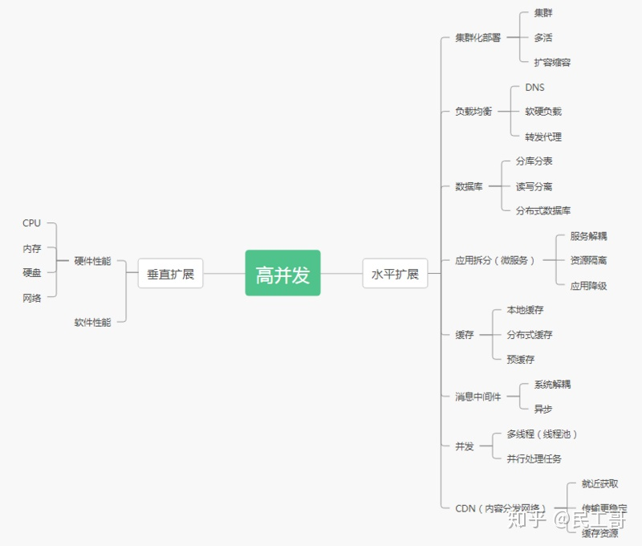

# 抗住百万高并发的 6 个关键技术

原文：[mysql能抗住多少tps_硬核干货！抗住百万高并发的 6 个关键技术！](https://blog.csdn.net/weixin_39862382/article/details/110869629?spm=1001.2101.3001.6661.1&utm_medium=distribute.pc_relevant_t0.none-task-blog-2%7Edefault%7ECTRLIST%7ERate-1.pc_relevant_default&depth_1-utm_source=distribute.pc_relevant_t0.none-task-blog-2%7Edefault%7ECTRLIST%7ERate-1.pc_relevant_default&utm_relevant_index=1)

## 一、什么是高并发

高并发（High Concurrency）是互联网分布式系统架构设计中必须考虑的因素之一，它通常是指，通过设计保证系统能够同时并行处理很多请求。

高并发相关常用的一些指标有响应时间（Response Time），吞吐量（Throughput），每秒查询率QPS（Query Per Second），每秒事务处理量TPS(Transaction Per Second)，并发用户数等。

- 响应时间：系统对请求做出响应的时间。
- 吞吐量：单位时间内处理的请求数量。
- QPS：每秒响应查询请求数。
- TPS：每秒响应事务请求数。
- 并发用户数：同时承载正常使用系统功能的用户数量。

## 二、提升系统的并发能力

互联网分布式架构设计，提高系统并发能力的方式，方法论上主要有两种：垂直扩展（Scale Up）与水平扩展（Scale Out）。

### （1）垂直扩展

垂直扩展：提升单机处理能力。垂直扩展的方式又有两种：
- 1）增强单机硬件性能，例如：增加CPU核数如32核，升级更好的网卡如万兆，升级更好的硬盘如SSD，扩充硬盘容量如2T，扩充系统内存如128G；
- 2）提升单机架构性能，例如：使用Cache来减少IO次数，使用异步来增加单服务吞吐量，使用无锁数据结构来减少响应时间；

### （2）水平扩展

水平扩展：只要增加服务器数量，就能线性扩充系统性能。水平扩展对系统架构设计是有要求的，如何在架构各层进行可水平扩展的设计是本文重点讨论的内容。

#### 1、系统集群化部署+负载均衡
- （1）添加负载均衡层，将请求均匀打到系统层。
- （2）系统层采用集群化多活部署，扛住初步的并发压力。
#### 2、数据库分库分表+读写分离+分布式数据库
- （1）分库分表：水平拆分、垂直拆分（弊端太多如关联查询）。
- （2）读写分离：主库写，从库读（数据同步延迟）。
- （3）分布式数据库：TiDB（HTAP、兼容MySQL协议、水平扩展、分布式事务）
#### 3、缓存
- （1）本地缓存：本地磁盘或内存。
- （2）分布式缓存：用缓存集群抗住大量的读请求。
- （3）预缓存，多级缓存。
#### 4、消息中间件
- （1）系统解耦，数据同步。
- （2）请求异步化处理，实现削峰填谷的效果。
#### 5、应用拆分（微服务）
- （1）按业务拆分、减少耦合。
- （2）分级部署，扩容缩容。
- （3）应用资源隔离。
#### 6、CDN（内容分发网络）
- （1）尽可能避开互联网上有可能影响数据传输速度和稳定性的瓶颈和环节, 使内容传输的更快更稳定。
- （2）CDN能够实时地根据网络流量和各节点的链接，负载状况以及到用户的距离和响应时间等综合信息将用户的请求重新导向离用户最近的服务节点上。